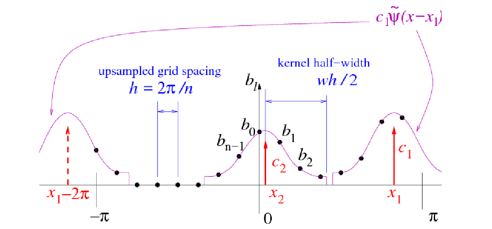

# Flatiron Institute Nonuniform Fast Fourier Transform library: FINUFFT

Principal author **Alex H. Barnett**,
main co-developers Jeremy F. Magland,
Ludvig af Klinteberg, Yu-hsuan "Melody" Shih, Libin Lu,
Joakim Andén, and Robert Blackwell;
see `docs/ackn.rst` for full list of contributors.
​

This is a lightweight CPU library to compute the three standard types of nonuniform FFT to a specified precision, in one, two, or three dimensions. It is written in C++ with interfaces to C, Fortran, MATLAB/octave, Python, and (in a separate [repository](https://github.com/ludvigak/FINUFFT.jl)) Julia. It now also integrates the GPU CUDA library cuFINUFFT (which currently does all but type 3).

Please see the [online documentation](http://finufft.readthedocs.io/en/latest/index.html) which can also be downloaded as a [PDF manual](https://finufft.readthedocs.io/_/downloads/en/latest/pdf/).
You will also want to see CPU example codes in the directories `examples`, `test`, `fortran`, `matlab/test`, `matlab/examples`, `python/finufft/test`, etc, and GPU examples in `examples/cuda`, `test/cuda`, etc

If you cannot build via cMake, try the old makefile. Python users try `pip install finufft`. See the docs for details. See our GitHub Issues for tips.

If you prefer to read text files, the source to generate the above documentation is in human-readable (mostly .rst) files as follows:

- `docs/install.rst` : installation and compilation instructions
- `docs/install_gpu.rst` : installation and compilation for GPU (CUDA)
- `docs/dirs.rst`    : explanation of directories and files in the package
- `docs/math.rst`    : mathematical definitions
- `docs/cex.rst`     : example usage from C++/C
- `docs/c.rst`       : documentation of C++/C function API
- `docs/c_gpu.rst`   : documentation of C++/C function API for GPU library
- `docs/opts.rst`    : optional parameters
- `docs/error.rst`   : error codes
- `docs/trouble.rst` : troubleshooting advice
- `docs/tut.rst` and `docs/tutorial/*` : tutorial application examples
- `docs/fortran.rst` : usage examples from Fortran, documentation of interface
- `docs/matlab.rst` and `docs/matlabhelp.raw` : using the MATLAB/Octave interface
- `docs/python.rst` and `python/*/_interfaces.py` : using the Python interface
- `docs/python_gpu.rst` : Python interface to GPU library
- `docs/julia.rst`   : options for Julia users
- `docs/devnotes.rst`: notes/guide for developers
- `docs/related.rst` : other recommended NUFFT packages
- `docs/users.rst`   : some known users of FINUFFT, dependent packages
- `docs/ackn.rst`    : authors and acknowledgments
- `docs/refs.rst`    : journal article references (both ours and others)

If you find (cu)FINUFFT useful in your work, please cite this repository and
the following. For FINUFFT (CPU library):

A parallel non-uniform fast Fourier transform library based on an ``exponential of semicircle'' kernel.
A. H. Barnett, J. F. Magland, and L. af Klinteberg.
SIAM J. Sci. Comput. 41(5), C479-C504 (2019).

For cuFINUFFT (GPU library):

cuFINUFFT: a load-balanced GPU library for general-purpose nonuniform FFTs,
Yu-hsuan Shih, Garrett Wright, Joakim Andén, Johannes Blaschke, Alex H. Barnett,
PDSEC2021 workshop of the IPDPS2021 conference. https://arxiv.org/abs/2102.08463

