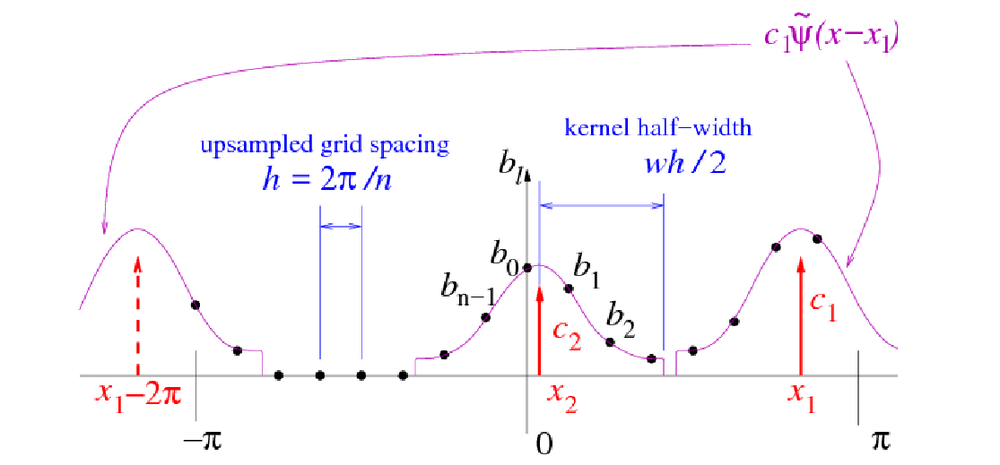

# Flatiron Institute Nonuniform Fast Fourier Transform library: FINUFFT

[)](https://pypi.org/project/finufft)
[)](https://pypi.org/project/cufinufft)

Principal author **Alex H. Barnett** (abarnett@flatironinstitute.org),
main co-developers Jeremy F. Magland,
Ludvig af Klinteberg, Yu-hsuan "Melody" Shih, Libin Lu,
Joakim Andén, Marco Barbone, Robert Blackwell, and Martin Reinecke;
see `docs/ackn.rst` for full list of contributors.
​

This is a lightweight CPU library to compute the three standard types of nonuniform FFT to a specified precision, in one, two, or three dimensions. It is written in C++ with interfaces to C, Fortran, MATLAB/octave, Python, and (in a separate [repository](https://github.com/ludvigak/FINUFFT.jl)) Julia. It now also integrates the GPU CUDA library cuFINUFFT.

Docs and installation
---------------------

Please see the [online documentation](http://finufft.readthedocs.io/en/latest/index.html) which can also be downloaded as a [PDF manual](https://finufft.readthedocs.io/_/downloads/en/latest/pdf/), and a [project overview](https://users.flatironinstitute.org/~ahb/notes/finufft-project-summary-2025.pdf).
You will also want to see CPU example codes in the directories `examples`, `test`, `fortran`, `matlab/test`, `matlab/examples`, `python/finufft/test`, etc, and GPU examples in `examples/cuda`, `test/cuda`, etc.

If you cannot build via cMake, try the makefile. Python users try `pip install finufft`. See the docs for details. See our GitHub Issues for tips.

Supported CPU platforms
-----------------------

The matrix below is mirrored from the CI workflows (`.github/workflows/cmake_ci.yml`,
`.github/workflows/powerpc.yml`); status cells are live badges. To regenerate
after editing a workflow, run `python tools/gen_platform_table.py` and paste
the output back into this section.

<!-- BEGIN: generated by tools/gen_platform_table.py -->

| Platform | Toolchains (per-job CI status) |
|----------|--------------------------------|
| MSYS2 MINGW64 |  |
| macos-14 |     |
| macos-15 |   |
| macos-15-intel |   |
| manylinux_2_28 |  |
| powerpc64 |  |
| powerpc64le |  |
| ubuntu-22.04 |       |
| ubuntu-24.04 |        |
| windows-2022 |   |
| windows-2025 |   |

_Each badge labels its toolchain and colours green/red with that job's current status on `master`. CMake-CI rows on Linux/macOS exercise both DUCC FFT and FFTW; Windows builds DUCC FFT only. `(make)` rows exercise the legacy GNU-make build path. PowerPC rows build via cross-compile + QEMU._

<!-- END: generated by tools/gen_platform_table.py -->

See also the [Supported CPU platforms](https://finufft.readthedocs.io/en/latest/install.html#supported-cpu-platforms) section of the rendered install docs.

If you prefer to read text files, the source to generate the above documentation is in human-readable (mostly .rst) files as follows:

- `docs/install.rst` : installation and compilation instructions
- `docs/install_gpu.rst` : installation and compilation for GPU (CUDA)
- `docs/dirs.rst`    : explanation of directories and files in the package
- `docs/math.rst`    : mathematical definitions
- `docs/cex.rst`     : example usage from C++/C
- `docs/c.rst`       : documentation of C++/C function API
- `docs/c_gpu.rst`   : documentation of C++/C function API for GPU library
- `docs/opts.rst`    : optional parameters
- `docs/error.rst`   : error codes
- `docs/trouble.rst` : troubleshooting and accuracy advice
- `docs/performance.rst` : CPU timing benchmarks compared to older versions
- `docs/tut.rst` and `tutorial/*` : tutorial application examples
- `docs/fortran.rst` : usage examples from Fortran, documentation of interface
- `docs/matlab.rst` and `docs/matlabhelp.raw` : using the MATLAB/Octave interface
- `docs/python.rst` and `python/*/_interfaces.py` : using the Python interface
- `docs/python_gpu.rst` : Python interface to GPU library
- `docs/julia.rst`   : information for Julia users
- `docs/nfft_migr.rst` and `docs/cufinufft_migration` : guides for migration
- `docs/impl_gpu.rst`: implementation notes for GPU code
- `docs/devnotes.rst`: notes/guide for developers
- `docs/related.rst` : other recommended NUFFT packages
- `docs/users.rst`   : some known users of FINUFFT, dependent packages
- `docs/ackn.rst`    : authors and acknowledgments
- `docs/refs.rst`    : journal article references (ours and others)

License
-------

For license info for FINUFFT (CPU/GPU source), see `LICENSE`.
For info for dependencies and contributed code, see `NOTICE`.

Support
-------

FINUFFT/cuFINUFFT was developed at, and is supported by,
the Flatiron Institute at the Simons Foundation.

Citing
------

If you find (cu)FINUFFT useful in your work, please star this repository and
cite it and the following. It will help us to improve the library if you also
describe your use case parameters
[here](https://github.com/flatironinstitute/finufft/discussions/398).

For FINUFFT (CPU library):

A parallel non-uniform fast Fourier transform library based on an ``exponential of semicircle'' kernel.
A. H. Barnett, J. F. Magland, and L. af Klinteberg.
SIAM J. Sci. Comput. 41(5), C479-C504 (2019).

For cuFINUFFT (GPU library):

cuFINUFFT: a load-balanced GPU library for general-purpose nonuniform FFTs,
Yu-hsuan Shih, Garrett Wright, Joakim Andén, Johannes Blaschke, Alex H. Barnett,
PDSEC2021 workshop of the IPDPS2021 conference. https://arxiv.org/abs/2102.08463
