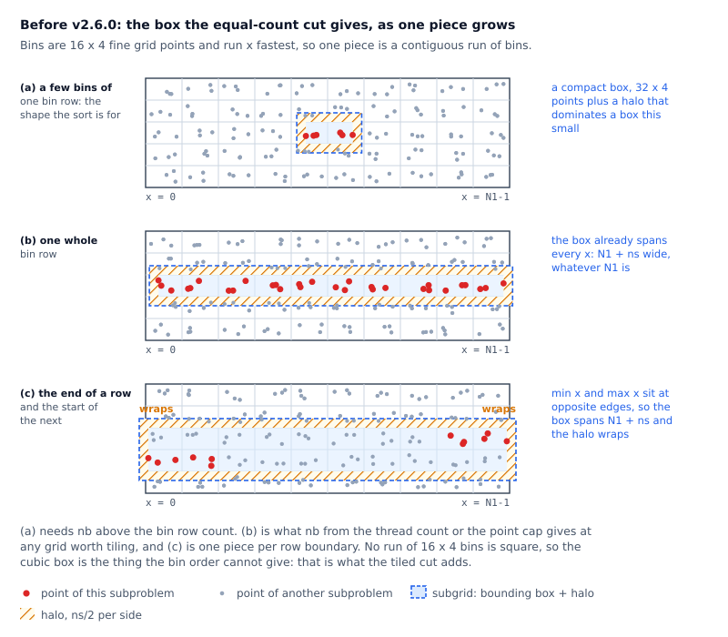
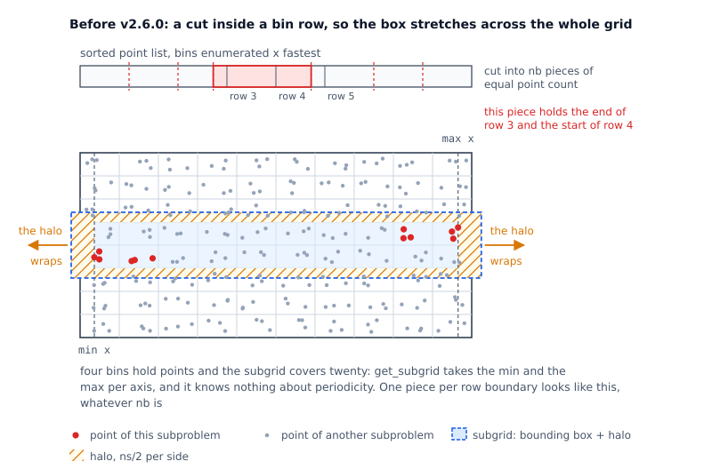
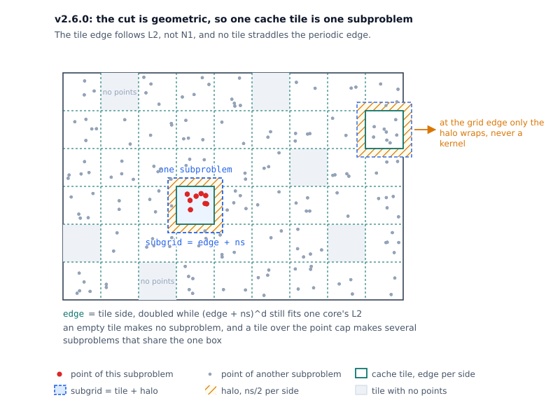
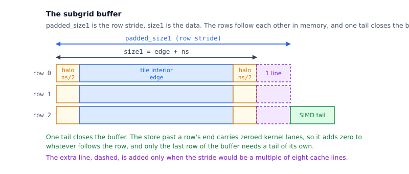

Code implementation details
===========================

This file contains detailed explanations of the algorithms and optimization strategies
used in the library, the GPU sections first and the CPU spreader and interpolator
second.

The focus is on clarity and reproducibility of the core computational techniques,
including spreading/interpolation schemes, memory access patterns, and kernel launch
structures.

.. note::

   This is a living document, started in 2025 (v 2.4.1). Implementation details are subject to change as
   performance and accuracy improvements are integrated.

GPU spreading and interpolation
-------------------------------

``gpu_method`` selects the GPU spreader, see :doc:`c_gpu`. This section covers the
output-driven spreader, ``gpu_method=3``.

Output driven
~~~~~~~~~~~~~

The **output-driven spreading strategy** is designed to reduce global memory traffic and
exploit shared memory locality. A CUDA block corresponds to a spatial tile in the output
grid, and shared memory is used to accumulate updates from multiple nonuniform points.
The original approach was developed by Juan Ignacio Polanco in
`NonuniformFFTs.jl <https://github.com/jipolanco/NonuniformFFTs.jl>`_.

The process follows three main stages:

1. **Per-thread kernel evaluation:**

   Each thread takes care of a single NU point and calculates all kernel values for that point.
   Kernel values are stored into shared memory (``kerevals``) in a batched layout,
   allowing reuse by all threads in the block.
   ``kerevals`` is a 3D array with shape ``(Np, dim, ns)``, where ``Np`` is the number of NUFFT points.
   Using CUDA parallelism it is possible to evaluate all the kernel values in parallel accessing
   ``kerevals(thread.id, dim, 0)``.
   The third parameter is always 0 because ``eval_kernel_vec``
   takes a pointer and writes ``ns`` values in one go.
   This corresponds to:

   .. code-block:: cpp

      eval_kernel_vec<T, ns>(&kerevals(i, 0, 0), x1, es_c, es_beta);

2. **Thread-cooperative accumulation in shared memory:**

   - Instead of assigning 1 thread per point (which would lead to shared memory collisions),
     all threads iterate over a small batch (``Np``) of NUFFT points.
     That is, the points are not processed in parallel, but the inner loop (tensor product) is.

     The **Shared Memory (SM) approach** does:

     .. code-block:: none

        parallel for point = 0 to NumPoints
          ...
          for x = 0 to ns
            for y = 0 to ns
              for z = 0 to ns
                ...

     The **Output-driven approach** does:

     For each point:

     - Loop over NUFFT points sequentially.
     - Parallelize over kernel grid entries using a flattened loop up to ``ns^{dim}``.

     Example pseudocode:

     .. code-block:: none

        for point = 0 to NumPoints, point+=np
          ...
          parallel for i = 0 to pow(ns, dim)
            ...
          ...

     The parallelism is flipped: SM parallelizes the outer loop (over points), while
     Output-driven parallelizes the inner loop (over the kernel values).
     There is no collision because the local grid tile (``local_subgrid``) is accessed by ``(ix, iy, iz)`` — and these
     are unique per thread as determined by the thread ID.
     This removes the need for ``AtomicAdd`` on the local subgrid.

3. **Atomic addition to global memory:**

   Unchanged from SM: once all points have been processed and accumulated into ``local_subgrid``,
   the block performs an atomic write to global memory (``fw``). Since this step is
   amortized over many points, its overhead is negligible.

Memory organization
^^^^^^^^^^^^^^^^^^^

- ``kerevals``:
  Stores kernel weights in shape ``(Np, dim, ns)``. Threads access only their assigned batch rows.

- ``local_subgrid``:
  A padded shared-memory grid with shape ``(bin_size + padding)^{dim}``.
  Where passing is ``padding = 2((ns+1)/2)``.
  Threads write to disjoint sections during accumulation to avoid races.

Design insights
^^^^^^^^^^^^^^^

This hybrid parallelization combines **per-point parallelism** (step 1) and **spatial parallelism**
(step 2):

- Threads collaborate rather than compete on shared memory access.
- Batching (``Np``) controls memory footprint and allows tuning for hardware constraints.
- Synchronization barriers ensure correctness before accessing shared buffers.

CPU spreading and interpolation
-------------------------------

This section describes the CPU spreader and the interpolator. It covers the cut of the
work into subproblems, the assignment of subproblems to threads, and the changes v2.6.0
made to both. For the option fields named here see :doc:`opts`.

Both directions of ``spopts.spread_direction`` use the same decomposition. Sec. 5.2 of
the FINUFFT paper (see :doc:`refs`) describes it for one vector: cut the sorted points
into subproblems, bound each subproblem's points by a cuboid, spread into that cuboid,
and add the cuboid back into the fine grid under one ``omp critical``. The cut targets
load balance. Every thread stays busy whatever the point distribution.

Every subproblem owns a **subgrid**, a cuboid of the fine grid. ``get_subgrid`` sizes
that cuboid as the bounding box of the subproblem's points, grown by ``ns/2`` on each
side, so every kernel of every point lands inside it. Here ``ns`` is
``spopts.nspread``, the kernel width. Spreading writes its subgrid, then adds the subgrid
into the fine grid. Interpolation reads its subgrid out of the fine grid.

The size of that box carries two costs.

**Residency.** The subgrid is the working set of one thread. A box that fits one core's
L2 stays resident for the whole subproblem. A larger box sends every kernel write out to
L3 or to memory, and evicts whatever else that core held.

**Traffic.** ``drain_wrapped_subgrid`` adds every cell of the box back into the fine
grid and zeroes the cell in the same pass, so the next subproblem finds the zero buffer
its kernels accumulate into without a second walk. The pass covers the box, not the
points, so an empty region of the box still moves under the write guard. Interpolation
incurs the same traffic once, in the gather of the box out of the fine grid.

Parallelism over the batch
~~~~~~~~~~~~~~~~~~~~~~~~~~

The paper's scheme parallelizes one vector. A transform of ``ntrans`` vectors runs in
batches, sized by ``makeplan`` from ``ntrans``, the thread count and
``opts.maxbatchsize``, so the batch gives a second axis for the threads.

Through v2.5.1 ``opts.spread_thread`` selected one of two nestings, and ``makeplan`` set
the field to 2 whenever the caller left it at 0. Scheme 2 gave the threads to the batch
loop and nested the spreader inside that loop. OpenMP nesting is off by default, so an
inner region inside an *active* outer region runs on one thread. Each vector still split
into ``nthr`` subproblems, but one thread ran them in sequence, and that thread
allocated, zeroed and added back every padded subgrid alone. A batch of one vector
avoided the loss, since an outer region of one thread is inactive and the spreader then
received every thread. Scheme 1 took the vectors in sequence and gave all threads to the
subproblems of one vector, which left the batch axis unused.

v2.6.0 drops the nesting. The subproblem count and its breakpoints come from plan state
alone, so every vector of a batch splits into the same subproblems, and the (vector,
subproblem) space is rectangular. One ``omp parallel`` region walks that space with
``collapse(2) schedule(dynamic, 1)``, and every thread draws pairs from it, so the
load-balance invariant holds at any ``ntrans``. ``opts.spread_thread`` therefore has
nothing left to select, and v2.6.0 deprecates the field and ignores it.

Two subproblems collide only when they add back into the same vector's fine grid. The
collapse therefore narrows the paper's process-wide ``omp critical`` to one guard per
fine grid, sized by the number of threads on one vector, see `The write guard`_ below.

Before v2.6.0: a subproblem is a slice of the point list
~~~~~~~~~~~~~~~~~~~~~~~~~~~~~~~~~~~~~~~~~~~~~~~~~~~~~~~~

The bin sort binned the points into bins of 16 x 4 x 4 fine grid points
(``bin_size_x``, ``bin_size_y``, ``bin_size_z``) and enumerated the bins with x fastest.
The subproblem count came from the thread count::

    nb = min(ceil(nthr / batchSize), M)              // one subproblem per thread
    if (nb * max_subproblem_size < M)                // the point cap binds
        nb = ceil(M / max_subproblem_size)           // so raise nb

``max_subproblem_size`` defaulted to 10000 in 1D and 100000 in 2D and 3D, and
``opts.spread_max_sp_size`` overrode it. The point list was then cut into ``nb`` pieces
of equal point count, ``brk[p] = (M*p + nb-1)/nb``.

That cut counted points. The cut never inspected the positions of those points. The bin
order was supposed to bring locality: a piece is a contiguous run of bins, so the piece
should cover a compact region of the grid. The number of bins in one piece decides the
result, and three outcomes are possible. A piece inside one bin row gives a compact box.
A piece that holds a whole bin row spans every x, since the bins run x fastest. A piece
that holds the end of one row and the start of the next spans every x *and* overhangs
both periodic edges.

         bin row, and a box spanning the grid and overhanging both edges

Note that the first outcome is rarely achieved. A run of 16 x 4 bins is never square, so
the best the sort can give is a strip a few bins wide and one bin row tall, with a halo
that dominates it at that size. The bin order cannot express a cubic box. The tiled cut
adds it.

In practice a piece does hold whole rows. Let ``R`` be the number of bin rows, which is
``nf2/bin_size_y`` in 2D and that times ``nf3/bin_size_z`` in 3D. ``nb`` against ``R``
decides which of the three outcomes a piece gets:

* ``nb <= R``: every piece holds ``R/nb`` rows or more, so every box is full width.
* ``nb > R``: a piece is shorter than a row, so only a piece that straddles a row
  boundary is full width, and there are ``R - 1`` boundaries to straddle.

``nb`` comes from the thread count or the point cap, so ``nb`` stays far below ``R`` on
any grid worth tiling, and the first regime is the common case. The widths of all ``nb``
subgrids of one 2D spread on v2.5 follow. The fine grid is 64 x 64, so ``R`` is 16;
four threads, ``ns=7``, cap 100000, and ``M`` raises ``nb``
(``spreadtestnd 2 M 4096 1e-6 1 2``, excluding the single-point warm-up spread it runs
first)::

    nb     boxes of width 72 (= 64 + ns + pad)     the other boxes
     5     5                                       none
    11     11                                      none
    41     15                                      11 of 56, 15 of 40
   161     15                                      48 of 40, 98 of 24

The first two rows are the first regime. Every box there is 72 x 23, the full width by
four bin rows plus the halo. The last two rows are the second regime. The count of
full-width boxes saturates at 15, one per boundary, and the other boxes narrow as ``nb``
grows. Only a very dense transform, a tiny grid with an enormous ``M``, pushes ``nb``
that far. The first regime therefore governs the common case, and there the box is as
wide as the fine grid and grows with it.

The worst case survives even where a piece is smaller than a bin row.
``max_subproblem_size`` caps the point count and never the geometry, so it cuts the list
at an arbitrary offset, and one piece per row boundary holds the **end of one bin row and
the start of the next**. The two halves lie at opposite edges of the grid.
``get_subgrid`` takes the minimum and the maximum of each coordinate and ignores
periodicity, so the box spans everything between the two halves, and its ``ns/2`` halo
pushes both ends past the grid edge. Clustered points produce the same box without the
cap: the minimum and the maximum reach across the empty space between the clusters.

         grid and overhangs both periodic edges

Such a subproblem incurs both costs. Residency: the box grows with ``N1``, so above some
transform size the box leaves L2 and evicts the rest of the core's cache. Traffic: the
add back covers a full-width box, while the kernels write only the few columns the points
fall in, so the subproblem moves the full width and only a fraction of that width carries
data. Raising ``nb`` through the cap does not help. Below
the row count every extra subproblem is another full-width box. Above it the number of
full-width boxes stays at one per row boundary.

The spreader prints its subgrids under ``opts.spread_debug=2``. A 2D type-1 spread of
one million uniformly distributed points onto a 512 x 512 fine grid, four threads and
``tol=1e-6`` (so ``ns=7``), on v2.5::

    spread 2D (M=1000000; N1=512,N2=512,N3=1), nthr=4, batch=1
    capping subproblem sizes to max of 100000
    subgrid: off -3,97       siz 520,63      #NU 100000
    subgrid: off -3,45       siz 520,63      #NU 100000
    subgrid: off -3,-3       siz 520,59      #NU 100000
    subgrid: off -3,149      siz 520,63      #NU 100000
    ...

All ten subgrids are 520 wide while ``N1`` is 512, and all start at ``-3``. Each box is
wider than the grid it sits in and overhangs both edges, as the figure above draws. A
wider grid widens every box with it, and the two costs break at different sizes. At 512
the box is 520 x 63, or 0.5 MB in complex double, which one core's L2 still holds. Only
the traffic is wasted there. The same run on a 4096 x 4096 fine grid reports
``siz 4104,419``, which is 27 MB per subproblem against a per-core L2 of a few MB, so
residency fails as well.

Interpolation had no subproblems. The loop took the points in chunks of one SIMD width,
``schedule(dynamic, 1000)``, and every kernel read the fine grid in place. Points whose
kernel crossed a grid edge went to separate wrap-aware kernels (``interp_line_wrap``,
``interp_square_wrap``, ``interp_cube_wrapped``). The sort brought read locality only.

v2.6.0: a subproblem is one cache tile
~~~~~~~~~~~~~~~~~~~~~~~~~~~~~~~~~~~~~~

The sort now cuts the *grid* instead of the list. The sort bins the points into cubic
tiles of the fine grid, and both directions take one tile as one subproblem.

Three properties follow: one for residency, one for the wrap, one for traffic.

**The box no longer tracks N1.** The side of the box is ``edge + ns``, and the cache sets
``edge``. ``spread_tile_doublings`` doubles the tile edge while two conditions hold: the
padded subgrid ``(edge + ns)^d`` fits one core's L2, and the strengths of the points the
tile is expected to hold fit a quarter of it. The subgrid is therefore cache-resident at
every transform size.

**The wrap case cannot arise.** A tile is a box of the fine grid, and a two-level
count-sort key puts the tile index in the high bits and the fine cell inside the tile in
the low bits, so one tile's points are contiguous in the sorted list. The bounding box
of those points lies inside the tile, and no tile straddles the periodic edge. Where a
tile *touches* that edge, the halo alone wraps, and ``walk_wrapped_subgrid`` splits the
add back or the gather into the runs it needs, so no kernel wraps.

**Empty space costs nothing.** The tile offsets define the subproblems, so a tile that
holds no points produces no subproblem, and a thinly filled tile produces a box bounded
by its own points instead of by the tile. The add back never touches a cell the points
cannot reach. The old cut had to hand every thread an equal count of
points wherever those points sat.

The two runs quoted above, on v2.6::

    spread tiles of 64 grid pts per edge, cells of 32
    spread 2D (M=1000000; N1=512,N2=512,N3=1), nthr=4, batch=1
    cache tiles: 64 subprobs over 81 tiles, cap 31250 pts
    subgrid: off 61,-3       siz 72,71      #NU 15627
    subgrid: off -3,-3       siz 72,71      #NU 15656
    ...

and on the 4096 x 4096 fine grid::

    spread tiles of 256 grid pts per edge, cells of 32
    cache tiles: 256 subprobs over 289 tiles, cap 7812 pts
    subgrid: off -3,-3       siz 264,263    #NU 3996
    ...

The box is 72 x 71 where the old one was 520 x 63, and 264 x 263 where the old one was
4104 x 419, which is 1.1 MB per subproblem instead of 27 MB. No box exceeds the width of
its grid. The tile edge grows from 64 to 256 as the same million points spread over the
larger grid, which is the tile sizer trading tile volume against halo cost.

Two ceilings still cap the points one subproblem may hold: twice the occupancy of an
average filled tile, and the point budget, ``L2 / (4 * 16 bytes)``. A tile over the cap
becomes several subproblems, and each subproblem calls ``get_subgrid`` on its own points,
so its box is bounded by the tile and then by the points that subproblem holds. That is
the difference from the old cap. Splitting a tile cannot widen a box, where cutting the
list could. Splitting does duplicate the halo, once per subproblem. The cap drops below
the budget only when the filled tiles cannot supply the four subproblems per thread the
schedule requires for load balance.

v2.6.0 therefore deprecates ``opts.spread_max_sp_size`` and ignores it. A subproblem is a
tile, and the cache sizes the tile.

With ``opts.spread_sort=0`` there are no tiles. The layout is one tile spanning the whole
fine grid, which is the box an unsorted point list spans anyway, and the cut falls back
to one subproblem per thread. ``indexSort`` is the only writer of the layout and
``setpts`` its only caller, and it clears the layout before it decides, so every spread
and interp until the next ``setpts`` cuts on the same one. A later ``setpts`` can re-size
the fine grid the verdict is stated over: a type-3 plan sizes it from the points it is
given, and a type-1 or type-2 plan on auto ``upsampfac`` re-plans when the point density
moves. The clear is what keeps a sorted call's tiling out of an unsorted call after it.

Non-uniform points
~~~~~~~~~~~~~~~~~~

Clustering is the worst case for the equal-count cut, and the case the geometric cut
bounds best. One 2D type-1 transform of one million points onto a 512 x 512 fine grid,
four threads, ``tol=1e-6``, over four distributions. **cells** is the sum of
``size1 * size2`` over the subproblems, so it counts the box area the add back covers,
once per vector::

    distribution         v2.5 largest box   cells    v2.6 largest box   cells
    uniform                    520 x 63      321k          72 x 71      327k
    16 tight clusters          411 x 135     162k          18 x 16       16k
    8 radial spokes            370 x 119     235k          72 x 71      146k
    one tight cluster           54 x 28      7.4k          36 x 29       27k

The two clustered rows show the traffic cost alone. An equal-count piece has to reach
across the empty space between the clusters, so v2.5 zeroes a 411 x 135 box, then adds
all 55k cells of that box into the fine grid under the write guard, for points that
occupy a few hundred cells. The box is mostly zeros in both directions. The tiled cut
bounds the box twice, by the tile and then by the points inside the tile, so the same
case gives 18 x 16 and a tenth of the cells. The uniform row shows that the total did not
move, 321k against 327k cells. What changed is the box one thread holds at a time, which
is residency.

One tight cluster is the case the tiled cut loses. Every old piece already covers that
one small box, while the point budget splits the tile into 32 subproblems, and each
subproblem carries its own copy of the box, for 27k cells against 7.4k. Both counts are
small in absolute terms, and the tiled cut incurs them where the transform is nearly empty.

The padded subgrid
~~~~~~~~~~~~~~~~~~

``Subgrid`` stores the extents, one row stride ``padded_size1``, and one ``tail``, all
set together through ``set_row_layout``. The buffer carries two kinds of padding: one
tail past its last row, and an optional extra cache line inside each row's stride.

         SIMD tail past the last row and an optional extra cache line per row

The **tail** absorbs the cells the innermost SIMD store writes past the end of a row.
The kernel lanes that reach past the end are zero, so no mask is needed, and the store
adds zero to whatever follows the row. A row therefore needs no tail of its own: only
the last row of the buffer reaches past the allocation, and ``cells()`` adds one tail
for it. The buffer stays zero between subproblems on its own: the drain zeroes
every cell a run reaches, and the cells no run reaches, the tail and the anti-alias gap,
keep the value they held, because that store writes back what it read.

The tile sizer pays for both extras: its L2 ceiling measures
``(edge + ns + line) * (edge + ns)^(d-1) + tail``, the cells the subproblem allocates,
and not the bare ``(edge + ns)^d`` tile.

The **anti-alias padding** is one extra cache line, added to the stride when the stride
would otherwise be a multiple of eight cache lines. Such a stride maps every row of the
subgrid onto the same eight L1 sets. The extra line shifts each row.

The write guard
~~~~~~~~~~~~~~~

Only spreading writes the fine grid. Neighbouring tiles' halos overlap, so two threads
can add back into the same cells, and the add back needs a guard. The guard is unchanged
from the untiled spreader. The threads in flight on one vector lie inside that vector's
window of subproblems, so at most ``min(nthr, nb)`` of them write one grid, and that
count selects the guard. At or below ``opts.spread_nthr_atomic`` the guard is one lock
per fine grid. Above it the add back uses atomic writes, which cost per element and
divide among the writers. A single subproblem per vector, or a single thread, owns its
grid and takes no guard.

Interpolation only reads the fine grid, so it takes no guard in any configuration. The
strengths return to the index each point held before the sort, so interpolation needs no
gathered strength buffer either.

TODO
~~~~

* Colouring the tiles so no two neighbours run at the same time would remove both guards
  from the add back (``spreadSorted``, ``include/finufft/spreadinterp.hpp``).
  Measurements so far justify it only under contention.
* A tile carries its halo whatever its occupancy, and empty tiles cost nothing, so the
  gain left is a tile edge chosen against that halo cost
  (``spread_tile_doublings``, ``include/finufft/spread.hpp``).
* Both directions still copy each subproblem's coordinates into per-thread buffers before
  the kernels run (``spreadSorted`` and ``interpSorted``).
