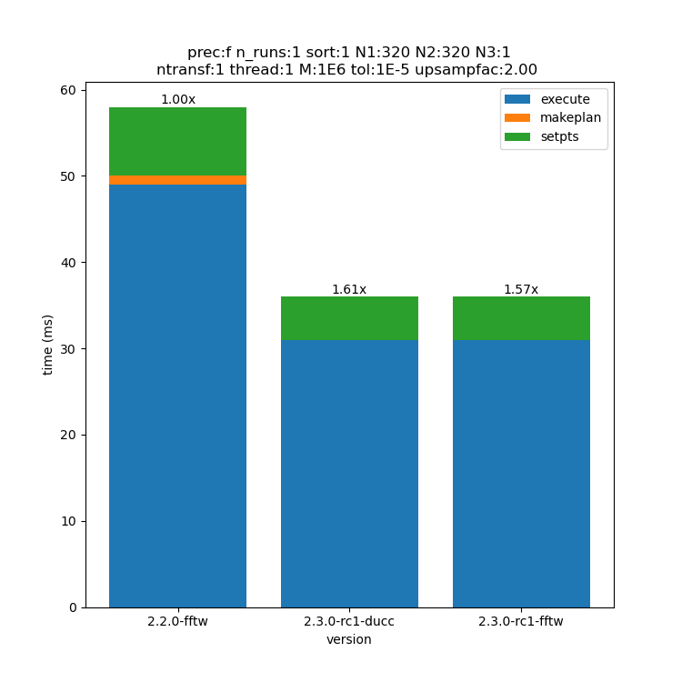
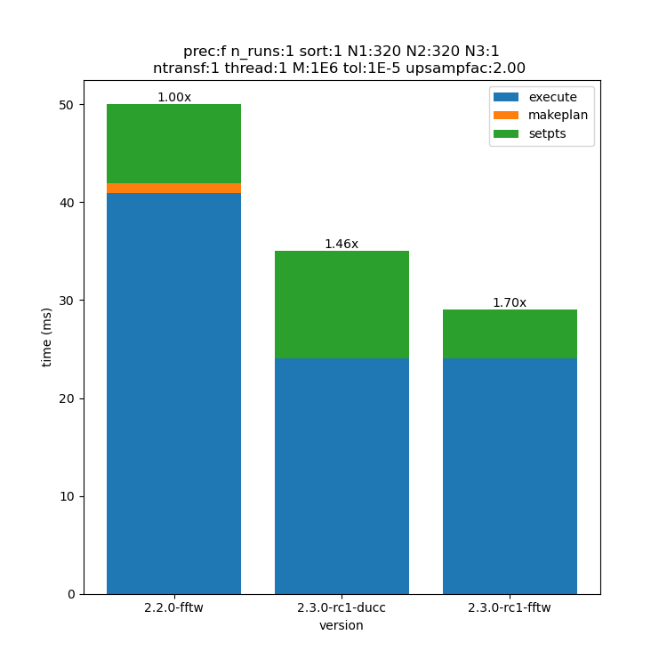

Performance
============

Version 2.3.0 introduces several novelties:
 - Explicit spreader vectorization (SIMD)
 - Support for ducc0 fft

This page shows the performance of the various version of FINUFFT starting from version 2.2.0. This is intended as a user guideline to select the best compile time configuration and the best runtime parameters.
The use case tested are taken from this `GitHub discussion <https://github.com/flatironinstitute/finufft/discussions/398>`_.
If none of the following examples is of any help for your specific use case, participating in the discussion is the best way to communicate with us and the benchmarks may be updated to satisfy the majority of the users.

The CPU used for all benchmarks is Intel(R) Xeon(R) w5-3435X, the compiler is GCC 13.2.0.
The title of the image contains the parameters used.
 - pref: precision f=float, d=double
 - N(x): dimension along one axes
 - M: number of non-uniform points
 - type: transform type (1, 2 or 3)

The other parameters are the same as finufft_opts.

2D MRI transform
---------------------------------------------

