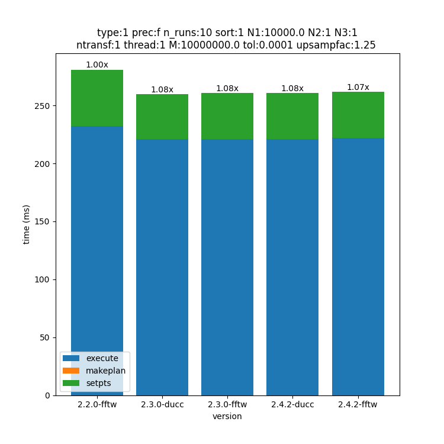
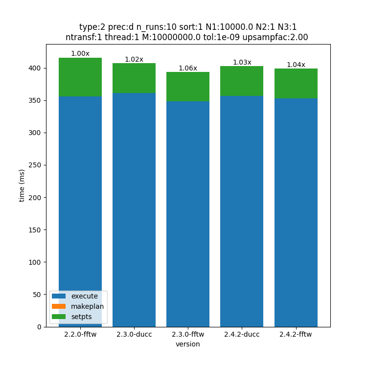
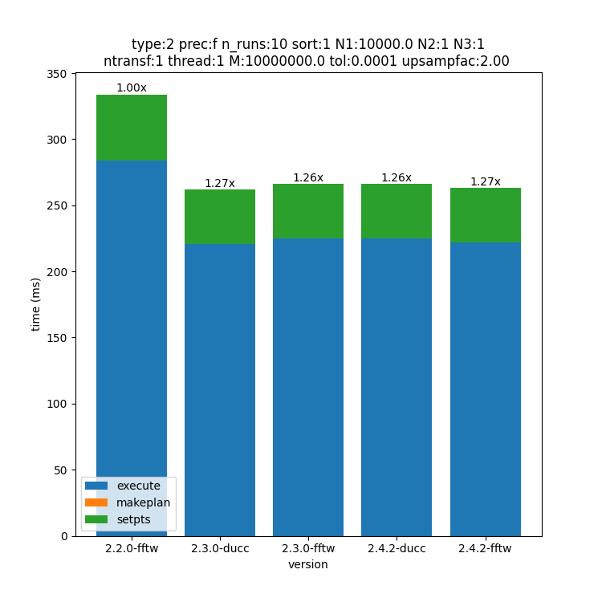
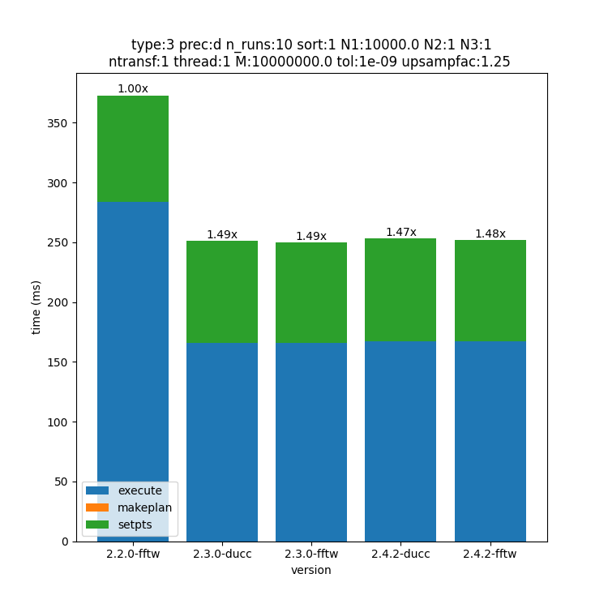
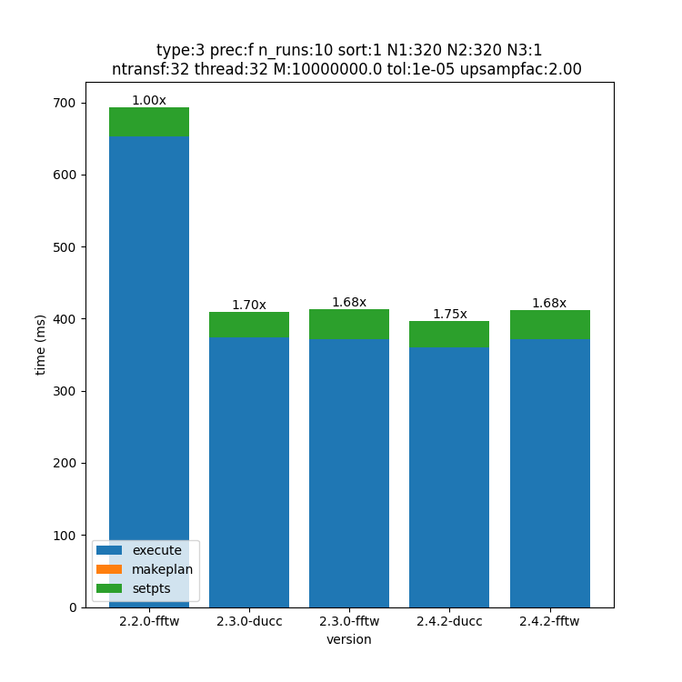
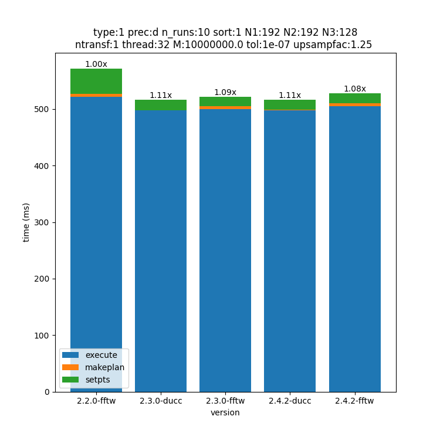
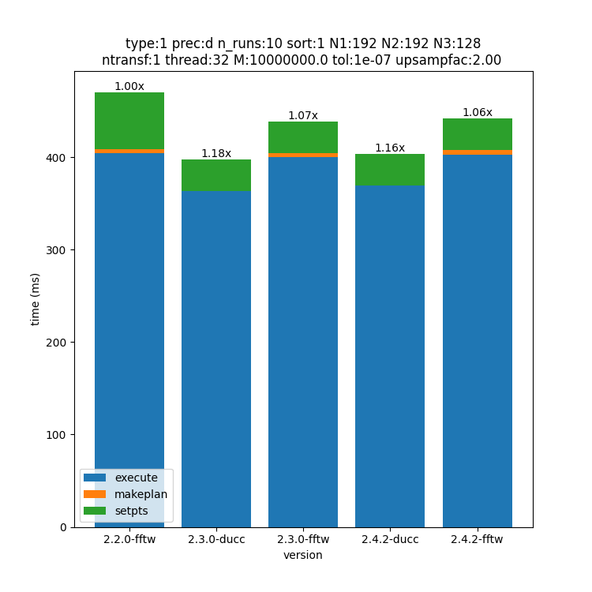
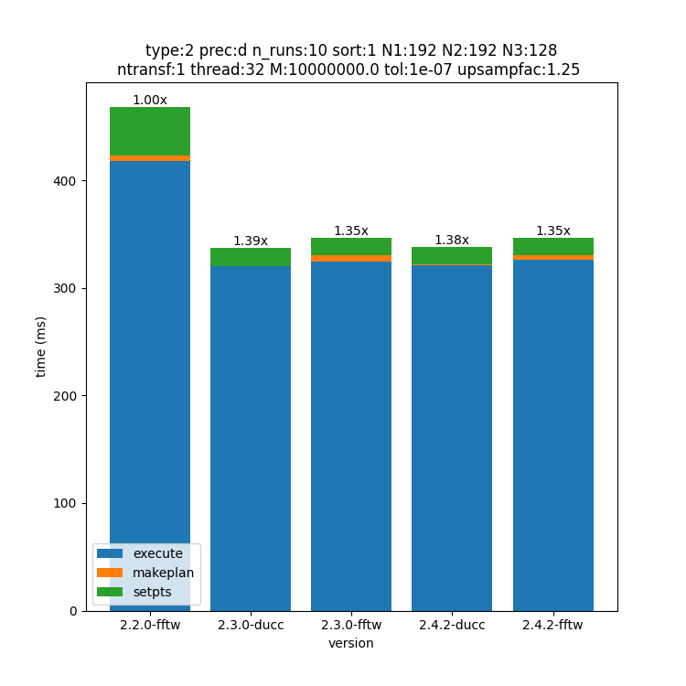
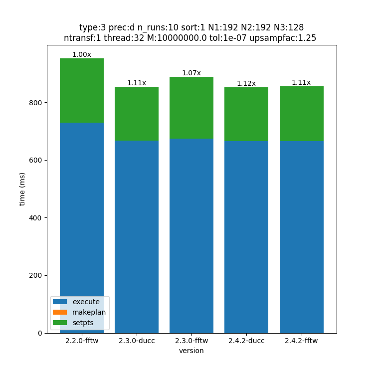
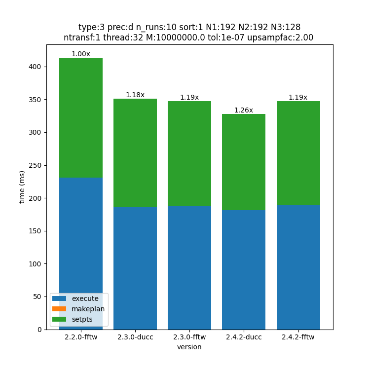

.. _performance:

Performance
===========

This page compares measured performance across various releases of the FINUFFT CPU library, starting from version 2.2.0 (December 2023).
One goal is to document progress between releases; another is to insure that performance does not regress.
The results should be compared against by users unsure if they are getting acceptable performance
on their machine; please also read our :ref:`troubleshooting <trouble>` page.
The results may also help the user to select the best compile time configuration (compiler, flags, FFT implementation) and the best runtime parameters (upsampling factor, number of threads).
Keep in mind that CPU performance depends on multiple parameters, including
dimensions, size, type, digits requested, upsampling factor, number of threads, compiler flags,
SIMD instructions available, and (as of 2.3.0) choice of FFT.
Due to the curse of dimensionality it is not possible to test all possible configurations.
Hence, we selected some user scenarios from this `GitHub discussion <https://github.com/flatironinstitute/finufft/discussions/398>`_.
If none of the following examples is of any help for your specific use case, participating in the discussion is the best way to communicate with us, so that benchmarks may be updated to satisfy more users.

This `GitHub discussion <https://github.com/flatironinstitute/finufft/discussions/452>`_ includes a snapshot of performance of the spreader/interpolator alone, for different compilers, and gives more insight on which one might be fastest for a specific CPU.

The CPU used for all benchmarks below is: Intel(R) Xeon(R) w5-3435X.
The compiler is GCC 13.2.0.
The compiler flags are the ones used by default in the ``CMakeLists.txt`` of the version tested; we only impose a Release build and ``-march=native``.
In the below graphs, the title includes the following parameters used:
 - type: transform type (1, 2 or 3)
 - pref: precision (f=float, d=double)
 - N1, N2, N3: numbers of modes in each dimension, or 1 if that dimension unused
 - ntransf: number of transforms (if >1, testing many-vector case)
 - M: number of non-uniform points
 - tol: tolerance
 - umsampfac: upsampling factor

The other parameters are set to defaults for ``finufft_opts``.

To generate the below results, run ``bench.py`` from the ``perftest`` directory.
This requires the Python packages ``numpy``, ``pandas`` and ``matplotlib``.
The script assumes a bash-like shell, and may not work on Windows.

.. warning::
    The script ``bench.py`` clones FINUFFT into the current directory, then switches between various branches and builds them. Thus DO NOT RUN the script from inside your FINUFFT git directory as it will mess up the git directory and fail! Instead move the script into a clean directory outside the git checkout and run there.

1D Transforms
---------------------------------------------

Type 1
~~~~~~~~~~~~~~~~~~~~~~~~~~~~~~~~~~~~~~~~~~~~~
.. image:: pics/10000x1x1-type-1-upsamp2.00-precf-thread1.png

.. image:: pics/10000x1x1-type-1-upsamp2.00-precd-thread1.png
.. image:: pics/10000x1x1-type-1-upsamp1.25-precd-thread1.png

Type 2
~~~~~~~~~~~~~~~~~~~~~~~~~~~~~~~~~~~~~~~~~~~
.. image:: pics/10000x1x1-type-2-upsamp1.25-precd-thread1.png
.. image:: pics/10000x1x1-type-2-upsamp1.25-precf-thread1.png

Type 3
~~~~~~~~~~~~~~~~~~~~~~~~~~~~~~~~~~~~~~~~~~~

.. image:: pics/10000x1x1-type-3-upsamp1.25-precf-thread1.png
.. image:: pics/10000x1x1-type-3-upsamp2.00-precd-thread1.png
.. image:: pics/10000x1x1-type-3-upsamp2.00-precf-thread1.png

2D transforms
---------------------------------------------
Type 1
~~~~~~~~~~~~~~~~~~~~~~~~~~~~~~~~~~~~~~~~~~~~~

.. image:: pics/320x320x1-type-1-upsamp1.25-precf-thread1.png
.. image:: pics/320x320x1-type-1-upsamp1.25-precd-thread1.png
.. image:: pics/320x320x1-type-1-upsamp2.00-precf-thread1.png
.. image:: pics/320x320x1-type-1-upsamp2.00-precd-thread1.png

Type 2
~~~~~~~~~~~~~~~~~~~~~~~~~~~~~~~~~~~~~~~~~~~
.. image:: pics/320x320x1-type-2-upsamp1.25-precf-thread1.png
.. image:: pics/320x320x1-type-2-upsamp1.25-precd-thread1.png
.. image:: pics/320x320x1-type-2-upsamp2.00-precf-thread1.png
.. image:: pics/320x320x1-type-2-upsamp2.00-precd-thread1.png

Type 3
~~~~~~~~~~~~~~~~~~~~~~~~~~~~~~~~~~~~~~~~~~~
.. image:: pics/320x320x1-type-3-upsamp1.25-precf-thread1.png
.. image:: pics/320x320x1-type-3-upsamp1.25-precd-thread1.png
.. image:: pics/320x320x1-type-3-upsamp2.00-precf-thread1.png
.. image:: pics/320x320x1-type-3-upsamp2.00-precd-thread1.png

2D transforms Multi-Threaded (float32)
---------------------------------------------

Type 1
~~~~~~~~~~~~~~~~~~~~~~~~~~~~~~~~~~~~~~~~~~~~~
.. image:: pics/320x320x1-type-1-upsamp1.25-precf-thread32.png

Type 2
~~~~~~~~~~~~~~~~~~~~~~~~~~~~~~~~~~~~~~~~~~~

.. image:: pics/320x320x1-type-2-upsamp2.00-precf-thread32.png

Type 3
~~~~~~~~~~~~~~~~~~~~~~~~~~~~~~~~~~~~~~~~~~~

3D transforms Multi-Threaded (float64)
---------------------------------------------

Type 1
~~~~~~~~~~~~~~~~~~~~~~~~~~~~~~~~~~~~~~~~~~~~~

Type 2
~~~~~~~~~~~~~~~~~~~~~~~~~~~~~~~~~~~~~~~~~~~

Type 3
~~~~~~~~~~~~~~~~~~~~~~~~~~~~~~~~~~~~~~~~~~~

