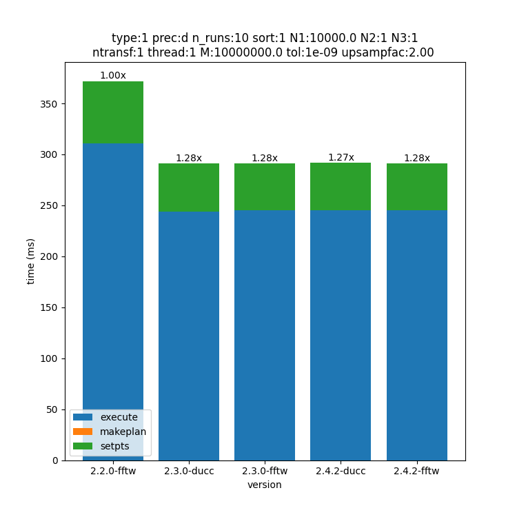
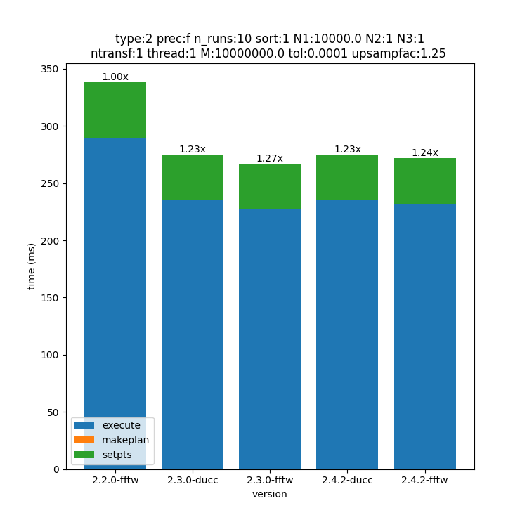
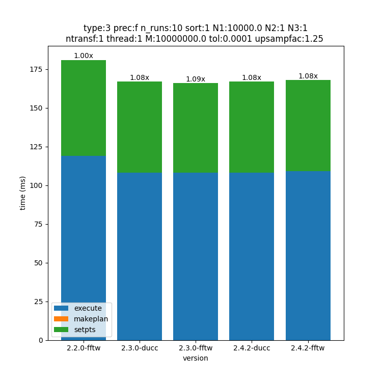
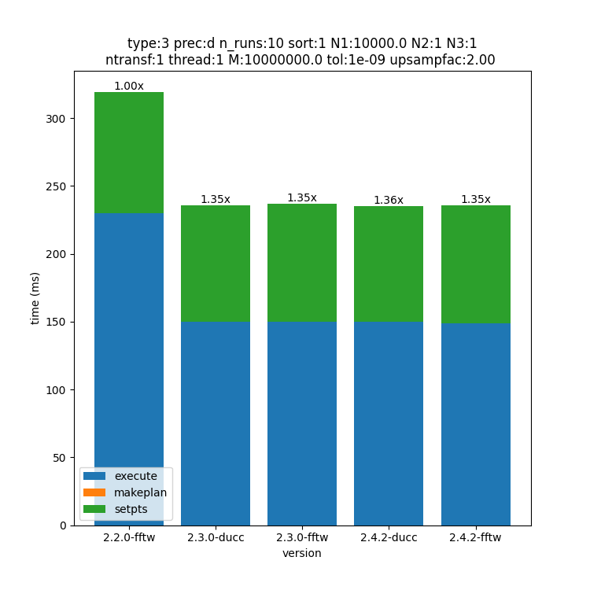
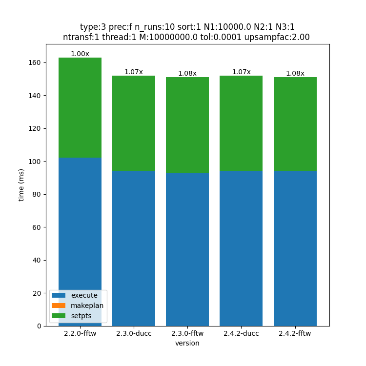
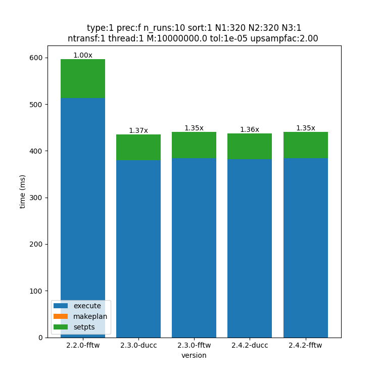
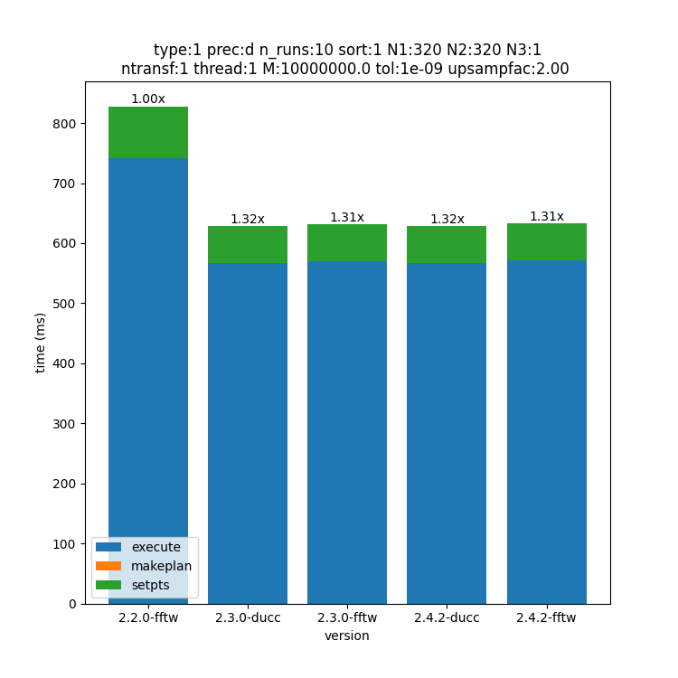
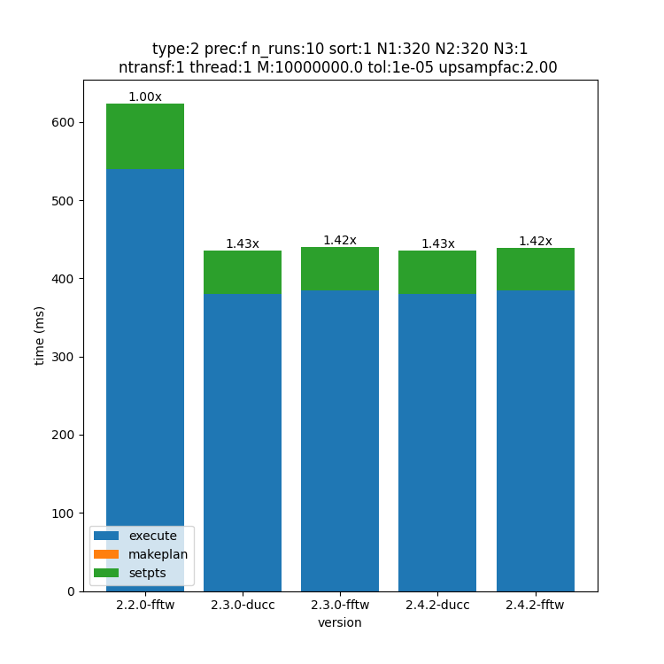
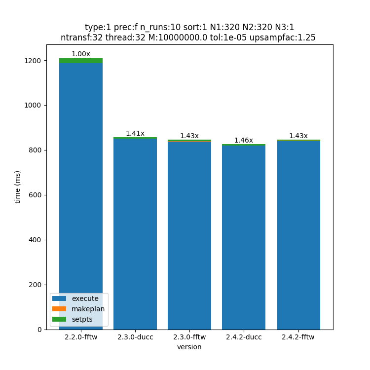
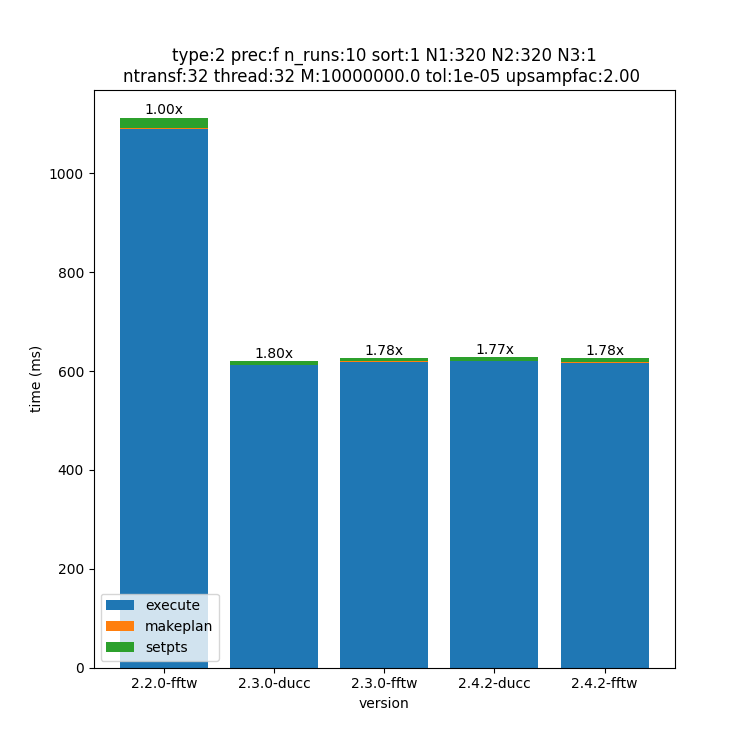

Performance
============

This page shows the performance of the various version of FINUFFT starting from version 2.2.0. The goal is to ensure that performance does not regress between releases.
The results serve also as a user guideline to select the best compile time configuration (compiler, flags, fft implementation) and the best runtime parameters (upsampling factor, number of threads).
Please note that the performance depends on multiple parameters.
Notably: dimensions, size, digits requested, upsamplig factor, CPU utilised, compiler flags, SIMD instructions.
Due to the curse of dimensionality it is not possible to test all possible configurations.
Hence, we selected some use cases from this `GitHub discussion <https://github.com/flatironinstitute/finufft/discussions/398>`_.
If none of the following examples is of any help for your specific use case, participating in the discussion is the best way to communicate with us and the benchmarks may be updated to satisfy the majority of the users.

This `GitHub discussion <https://github.com/flatironinstitute/finufft/discussions/452>`_ shows instead the performance of the spreader/interpolator with different compilers and gives more insight on which one might be the faster for a specific CPU.

The CPU used for all benchmarks is Intel(R) Xeon(R) w5-3435X, the compiler is GCC 13.2.0.
The compiler flags are the ones used as a default in the CMakeLists.txt of the version tested we only impose a Release build and `-march=native`.
The title of the image contains the parameters used.
 - pref: precision f=float, d=double
 - N(x): dimension along one axes
 - M: number of non-uniform points
 - type: transform type (1, 2 or 3)

The other parameters are the same as finufft_opts.

To generate the results run `bench.py` as is inside perftest. It requires ``numpy``, ``pandas`` and ``matplotlib``.
The script assumes a bash like shell and it might not work on Windows.
DO NOT RUN the script from inside the finufft git directory as it will mess up the git directory and fail!

1D Transforms
---------------------------------------------

Type 1
~~~~~~~~~~~~~~~~~~~~~~~~~~~~~~~~~~~~~~~~~~~~~
.. image:: pics/10000x1x1-type-1-upsamp2.00-precf-thread1.png
.. image:: pics/10000x1x1-type-1-upsamp1.25-precf-thread1.png

Type 2
~~~~~~~~~~~~~~~~~~~~~~~~~~~~~~~~~~~~~~~~~~~
.. image:: pics/10000x1x1-type-2-upsamp1.25-precd-thread1.png

.. image:: pics/10000x1x1-type-2-upsamp2.00-precd-thread1.png
.. image:: pics/10000x1x1-type-2-upsamp2.00-precf-thread1.png

Type 3
~~~~~~~~~~~~~~~~~~~~~~~~~~~~~~~~~~~~~~~~~~~
.. image:: pics/10000x1x1-type-3-upsamp1.25-precd-thread1.png

2D transforms
---------------------------------------------
Type 1
~~~~~~~~~~~~~~~~~~~~~~~~~~~~~~~~~~~~~~~~~~~~~

.. image:: pics/320x320x1-type-1-upsamp1.25-precd-thread1.png

Type 2
~~~~~~~~~~~~~~~~~~~~~~~~~~~~~~~~~~~~~~~~~~~
.. image:: pics/320x320x1-type-2-upsamp1.25-precf-thread1.png
.. image:: pics/320x320x1-type-2-upsamp1.25-precd-thread1.png

.. image:: pics/320x320x1-type-2-upsamp2.00-precd-thread1.png

Type 3
~~~~~~~~~~~~~~~~~~~~~~~~~~~~~~~~~~~~~~~~~~~
.. image:: pics/320x320x1-type-3-upsamp1.25-precf-thread1.png
.. image:: pics/320x320x1-type-3-upsamp1.25-precd-thread1.png
.. image:: pics/320x320x1-type-3-upsamp2.00-precf-thread1.png

2D transforms Multi-Threaded
---------------------------------------------

Type 1
~~~~~~~~~~~~~~~~~~~~~~~~~~~~~~~~~~~~~~~~~~~~~

.. image:: pics/320x320x1-type-1-upsamp2.00-precf-thread32.png

Type 2
~~~~~~~~~~~~~~~~~~~~~~~~~~~~~~~~~~~~~~~~~~~
.. image:: pics/320x320x1-type-2-upsamp1.25-precf-thread32.png

Type 3
~~~~~~~~~~~~~~~~~~~~~~~~~~~~~~~~~~~~~~~~~~~
.. image:: pics/320x320x1-type-3-upsamp1.25-precf-thread32.png
.. image:: pics/320x320x1-type-3-upsamp2.00-precf-thread32.png

3D transforms Multi-Threaded (float32)
---------------------------------------------

Type 1
~~~~~~~~~~~~~~~~~~~~~~~~~~~~~~~~~~~~~~~~~~~~~
.. image:: pics/192x192x128-type-1-upsamp1.25-precf-thread32.png
.. image:: pics/192x192x128-type-1-upsamp2.00-precf-thread32.png

Type 2
~~~~~~~~~~~~~~~~~~~~~~~~~~~~~~~~~~~~~~~~~~~
.. image:: pics/192x192x128-type-2-upsamp1.25-precf-thread32.png
.. image:: pics/192x192x128-type-2-upsamp2.00-precf-thread32.png

Type 3
~~~~~~~~~~~~~~~~~~~~~~~~~~~~~~~~~~~~~~~~~~~
.. image:: pics/192x192x128-type-3-upsamp1.25-precf-thread32.png
.. image:: pics/192x192x128-type-3-upsamp2.00-precf-thread32.png
