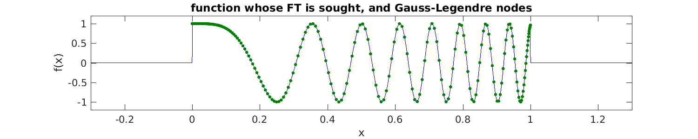
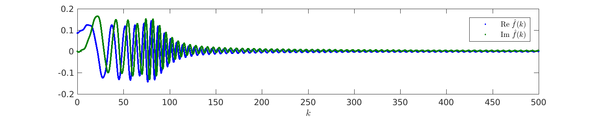
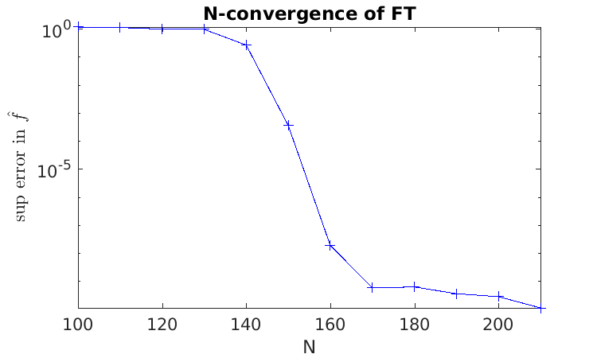
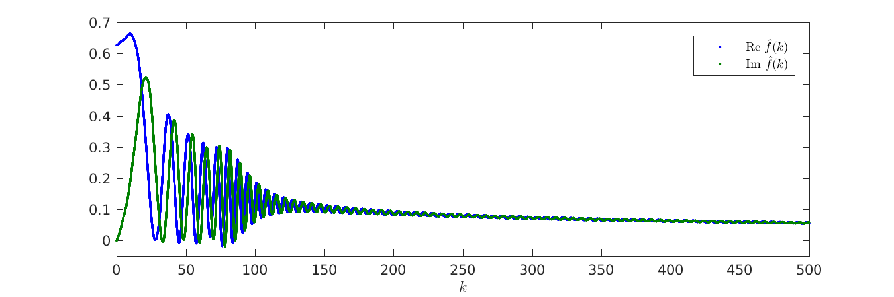
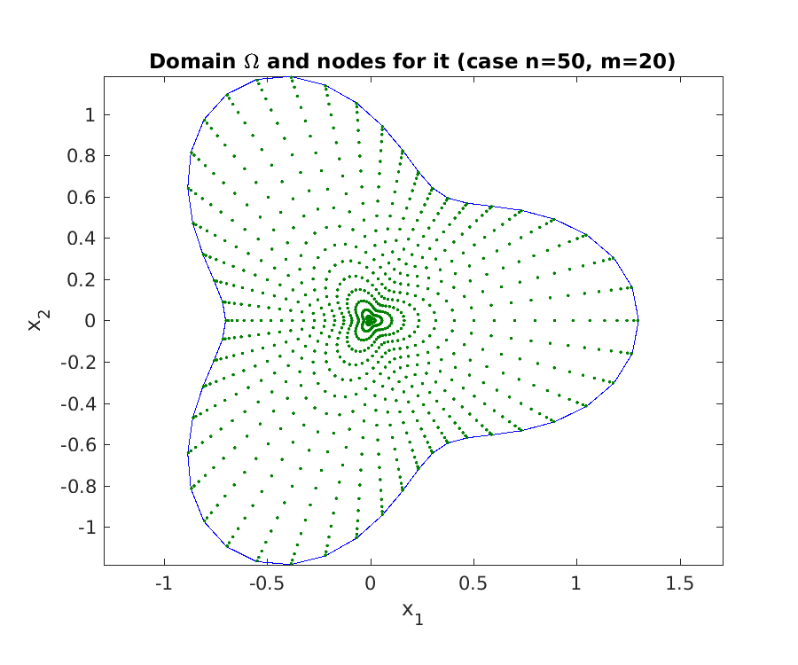
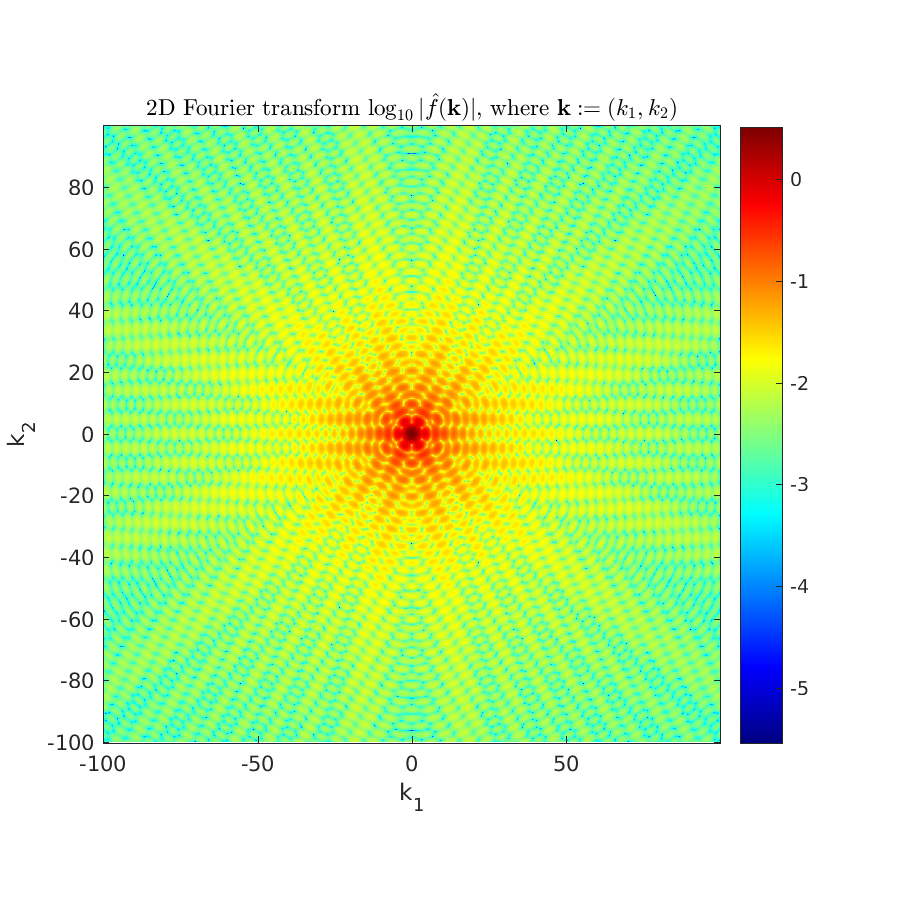

.. _contft:

Efficient evaluation of (continuous) Fourier transforms
======================================================================

Say you want to evaluate the
continous (as opposed to discrete)
Fourier *transform* (FT) of a
given function, but you do not know the analytic formula for the FT.
You need a numerical method.
It is common to assume that the FFT is the right tool to do this,
but this rarely so ...unless you are
content with very poor accuracy!  The reason is that the FFT applies
only to equispaced data samples, which enforces the use of $N$ equispaced
nodes in any quadrature scheme for the Fourier integral.
Thus, unless you apply endpoint weight corrections (which are
available only in 1D, and stable only up to around 8th order; see references
at the bottom of this page),
you are generally stuck
with 1st or 2nd order (the standard trapezoid rule)
convergence with respect to $N$.
And there are many situations where a FFT-based scheme would be even worse:
this includes nonsmooth or singular functions (which demand custom
quadrature rules even in 1D), smooth functions with varying scales
(demanding *adaptive* quadrature for efficiency),
and possibly nonsmooth functions on complicated domains in higher dimensions.

Here we show that the NUFFT is often the right tool for
efficient and accurate Fourier
tranform evaluation, since it allows the user to apply
their favorite quadrature scheme
as appropriate for whatever nasty function they desire.
As long as $N$ is bigger than around 10, the NUFFT becomes more efficient
than direct evaluation of exponential sums; as we know, most quadrature
rules, especially in 2D or 3D, involve many more points than this.

1D FTs evaluated at arbitrary frequencies
~~~~~~~~~~~~~~~~~~~~~~~~~~~~~~~~~~~~~~~~~~~~~~~~~~~~~~~~~~~~~~~

Given a function $f$, we'll need a single quadrature scheme with nodes
$x_j$ and weights $w_j$, $j=1,\dots, N$, that allows *accurate*
approximation of its Fourier integral

.. math:: \hat{f}(k) = \int f(x) e^{ikx} dx
   \approx \sum_{j=1}^N f(x_j) e^{ikx_j} w_j
   :label: fint

for all "target" frequencies $k$ in some domain of interest.
You can apply the below to any $f$ for which you have such a rule.

For simplicity let's take $f$ a smooth (somewhat oscillatory) function on $(a,b)$,
choose a million random frequency targets out to some ``kmax``,
then pick Gauss-Legendre quadrature for $(a,b)$:

.. code-block:: matlab

  a=0; b=1;                     % interval
  f = @(x) cos(50*x.^2);        % our smooth function defined on (a,b), zero elsewhere
  M = 1e6;                      % # targets we want to compute the FT at
  kmax = 500;
  k = kmax * (2*rand(1,M)-1);   % desired target frequencies
  N = 200;                      % how many quadrature nodes
  [xj,wj] = lgwt(N,a,b);        % quadrature rule for smooth funcs on (a,b)

Below is $f$ with the 200-node rule overlayed on it. You'll notice that the rule seems to be excessively fine (over-resolving $f(x)$), but that's because it actually needs to be able to resolve $f(x) e^{ikx}$ for all of our $k$ values:

Notice :eq:`fint` is simply a type 3 NUFFT with strengths $c_j = f(x_j) w_j$,
so we evaluate it by calling FINUFFT (this takes 0.1 sec) then plot the resulting FT at its target $k$ points:

.. code-block:: matlab
           
  tol = 1e-10;
  fhat = finufft1d3(xj, f(xj).*wj, +1, tol, k);
  plot(k, [real(fhat),imag(fhat)], '.');

This looks like a continuous curve, but is actually (half a) million discrete points. Notice that because $f$ was discontinuous on $\mathbb{R}$, $\hat{f}(k)$ decays slowly like $|k|^{-1}$. How do we know to trust the answer? A convergence study in ``N`` shows that
200 nodes was indeed enough to reduce the quadrature error to below the
$10^{-10}$ NUFFT tolerance:

.. code-block:: matlab

  Ns = 100:10:220;             % N values to check convergence
  for i=1:numel(Ns), N=Ns(i);
    [xj,wj] = lgwt(N,a,b);     % N-node quadrature scheme for smooth funcs on (a,b)
    fhats{i} = finufft1d3(xj, f(xj).*wj, +1, tol, k);
  end
  f0 = norm(fhats{end},inf);   % compute rel sup norm of fhat vs highest-N case
  for i=1:numel(Ns)-1, errsup(i) = norm(fhats{i}-fhats{end},inf)/f0; end
  semilogy(Ns(1:end-1),errsup,'+-');

Remember: always do a convergence study!
We see rapid spectral convergence as the quadrature rule resolves the
oscillations in $e^{ikx}$ at $|k|=k_\text{max}$.
See `tutorial/contft1d.m <https://github.com/flatironinstitute/finufft/blob/master/tutorial/contft1d.m>`_ for the full code.

.. note::

  If you cared about only a few very high $k$ values, `numerical steepest descent <https://users.flatironinstitute.org/~ahb/notes/numsteepdesc.html>`_ applied at the endpoints $a$ and $b$ would eventually beat the above.

Faster FTs when frequencies lie on a grid
~~~~~~~~~~~~~~~~~~~~~~~~~~~~~~~~~~~~~~~~~~~~~~~~~~~~~~~~~~~~~~~~~~~~

When the target frequencies lie on a uniform grid, the above type 3
NUFFT can be replaced by a type 1, which is faster, by a simple rescaling.
Say that we replace the random targets in the above
example by this uniform grid with spacing ``dk``:

.. code-block:: matlab

  dk = 2*kmax/M;              % spacing of target k grid
  k = dk * (-M/2:(M/2-1));    % a particular uniform M-grid of this spacing

Reusing our quadrature ``xj``, ``wj`` from above, we wish to stretch
the frequency grid from spacing ``dk`` to have unit spacing, which is the
integer (Fourier mode) grid implied by :eq:`1d1`, the definition of the
type 1. This is equivalent to squeezing the inputs $x_j$ by the same factor,
which we do as we send them in:

.. code-block:: matlab

  cj = f(xj).*wj;             % strengths (same as before)
  fhat = finufft1d1(dk*xj, cj, +1, tol, M);   % type 1, requesting M modes

This took only 0.05 sec, around twice as fast as before. We must check it is
giving what we want:

.. code-block:: matlab

  fhat3 = finufft1d3(xj, cj, +1, tol, k);     % old type 3 method
  norm(fhat-fhat3,inf)

which reports around ``3e-11``, so it worked.
Note the specific offset of the ``k`` grid
matched that of the Fourier mode indices; if you want a different offset,
you will have to shift (by it to this specific offset, then post-multiply
``fhat`` with a corresponding phase.

1D FTs of singular functions
~~~~~~~~~~~~~~~~~~~~~~~~~~~~~~~~~~~~~~~~~~~~~~~~~~~~~

The above $f$ was merely discontinuous. But you can now go further and easily
replace $(x_j,w_j)$ by a rule that is accurate for 
a function with known singularities. Eg, say $f(x) = x^{-1/2}g(x)$ where $g$ is smooth
on $[0,1]$, then the change of variable $x=y^2$ means
that $\int_0^1 f(x) dx = \int_0^1 2y f(y) dy$, the latter having a
smooth integrand to which plain Gauss-Legendre can be applied,
giving a new rule $x'_j = x_j^2$ and $w'_j = 2x_j w_j$.
Notice how this bypassed the pain of
building a $(\alpha=0,\beta=-1/2)$ Gauss-Jacobi quadrature!

Let's try out this new rule on a suitably singular function, keeping
other aspects the same as the above type 1 method:

.. code-block:: matlab

 f = @(x) cos(50*x.^2)./sqrt(x);    % singular function defined on (0,1), zero elsewhere
 Ns = 180:20:240;                   % N values to check convergence
 for i=1:numel(Ns), N=Ns(i);
   [xj,wj] = lgwt(N,a,b);           % N-node scheme for smooth funcs on (0,1)
   wj = 2*xj.*wj; xj = xj.*xj;      % convert to rule for -1/2 power singularity @ 0
   fhats{i} = finufft1d1(dk*xj, f(xj).*wj, +1, tol, M);         % type 1 as above
 end
 f0 = norm(fhats{end},inf);         % compute rel sup norm of fhat vs highest-N case
 for i=1:numel(Ns)-1, errsup(i) = norm(fhats{i}-fhats{end},inf)/f0; end
 disp([Ns(1:3); errsup(1:3)]')
 fhat = fhats{end}; plot(k, [real(fhats),imag(fhat)], '.');

This exhibits rapid convergence kinking in at a slightly higher $N$, while $\hat{f}(k)$
now has even slower decay (which one can check is $|k|^{-1/2}$):

.. code-block:: matlab
                
                       180         0.208975054515039
                       200      3.04233050928417e-05
                       220       1.9202016281569e-10

Neither $f$ nor $\hat{f}$ is in $L^2(\mathbb{R})$.
Other rules (adaptive, etc) can be designed to efficiently handle various other features of even nastier $f$ choices.

.. _contft2d:

2D FTs
~~~~~~~~

In higher dimensions, the idea is the same: set up a good quadrature rule
for your function $f$, then apply it to the Fourier integral

.. math:: \hat{f}({\bf k}) = \int f({\bf x}) e^{i{\bf k}\cdot{\bf x}} d{\bf x}
   \approx \sum_{j=1}^N f({\bf x}_j) e^{i{\bf k}\cdot{\bf x}_j} w_j
   :label: fint2

for all "target" frequencies ${\bf k}$ in your domain of interest.
We demo the case of $f = \chi_\Omega$, the characteristic function of a
bounde domain $\Omega \subset \mathbb{R}^2$, that is, $f({\bf x}) = 1$ for
$x\in\Omega$, and $0$ otherwise. For simplicity, let's take
$\Omega$ with boundary described in polar coordinates by
$g(\theta) = 1 + 0.3\cos 5\theta$. This enables a simple
two-level quadrature scheme,
namely an outer $n$-node periodic trapezoid rule in $\theta$, whose integrand
is an inner $m$-node Gauss-Legendre rule applied to the radial integral.
Since $g$ is smooth, this will have spectral convergence in $n$ and $m$.
Here is a fresh code to make this quadrature over $\Omega$:

.. code-block:: matlab
                
 g = @(t) 1 + 0.3*cos(3*t);                             % boundary shape
 n = 280;                                               % # theta nodes
 t = 2*pi*(1:n)/n; wt = (2*pi/n);                       % theta nodes, const weights
 bx = cos(t).*g(t); by = sin(t).*g(t);                  % boundary points
 m = 70;                                                % # r nodes
 [xr,wr] = lgwt(m,0,1);                                 % rule for (0,1)
 xj = nan(n*m,1); yj = xj; wj = xj;
 for i=1:n                                              % loop over angles
   r = g(t(i)); jj = (1:m) + (i-1)*m;                   % this radius; index list
   xj(jj) = cos(t(i))*r*xr; yj(jj) = sin(t(i))*r*xr;    % line of nodes
   wj(jj) = wt*r^2*xr.*wr;            % theta weight times rule for r.dr on (0,r)
 end
 plot([bx bx(1)],[by by(1)],'-'); hold on; plot(xj,yj,'.');
                

Note that we reduced the numbers of nodes in the plot for clarity.
Say we want $\hat{f}$ on a 2D square grid of frequency targets.
We apply the 2D version of the above type 1 scheme.
The function is identically 1 in the domain, so the weights simply
become the source strengths. We also image the result on a log scale:

.. code-block:: matlab

 kmax = 100;                                            % half the side length in k
 M1 = 1e3;                                              % target grid will be M1-by-M1
 dk = 2*kmax/M1;
 k1 = dk * (-M1/2:(M1/2-1));                            % same 1D freq grid as before
 tol = 1e-9;
 fhat = finufft2d1(dk*xj, dk*yj, wj, +1, tol, M1, M1);  % M1^2 output nodes
 imagesc(k1,k1,log10(abs(fhat))'); axis xy equal tight; colorbar

             
Thus we have computed the 2D FT of a discontinous function on a million-point grid to around 10-digit accuracy in 0.05 sec (the FINUFFT transform time).
Note that, as with 1D discontinuous functions, the decay with $k:=|{\bf k}|$ is slow (it is like $1/k$).
See the full code `tutorial/contft2d.m <https://github.com/flatironinstitute/finufft/blob/master/tutorial/contft2d.m>`_ also for the study that shows that, for the above ``kmax``, convergence to the tolerance has occurred by ``n=280`` and ``m=70``, needing $N=19600$ nodes. A more efficient set would vary ``m`` with $\theta$.

.. note::

   An application of the above to optics is that $\Omega$ is a planar scatterer
   (or its complement, an aperture, via Babinet's principle) upon which a monochromatic
   plane wave is incident. The wavelength is small compared to the size
   of $\Omega$, so that a scalar Kirchhoff diffraction model is a good one.
   If a downstream planar detector is very distant (the Fraunhofer diffraction limit),
   and the angles of scattering are small,
   then $|\hat{f}|^2$ is a good model for the detected scattered intensity.
                

Further reading
~~~~~~~~~~~~~~~~

Higher-order end corrections to the trapezoid rule
in 1D settings can allow all but ${\cal O}(1)$ of the nodes to
be on a regular grid. They also can be useful for known singularities
(log, 1/sqrt, etc):

* Kapur, S., Rokhlin, V. High-order corrected trapezoidal quadrature rules for singular functions. SIAM J. Numer. Anal. 34(4), 1331–1356 (1997)

* Alpert, B. K. Hybrid Gauss-Trapezoidal Quadrature Rules,
  SIAM J. Sci. Comput. 20(5), 1551–1584 (1999)

Kirchhoff approximation and Fraunhofer diffraction in optics:

* M. Born and E. Wolf, *Principles of Optics*, 6th edition. Section 8.3.

