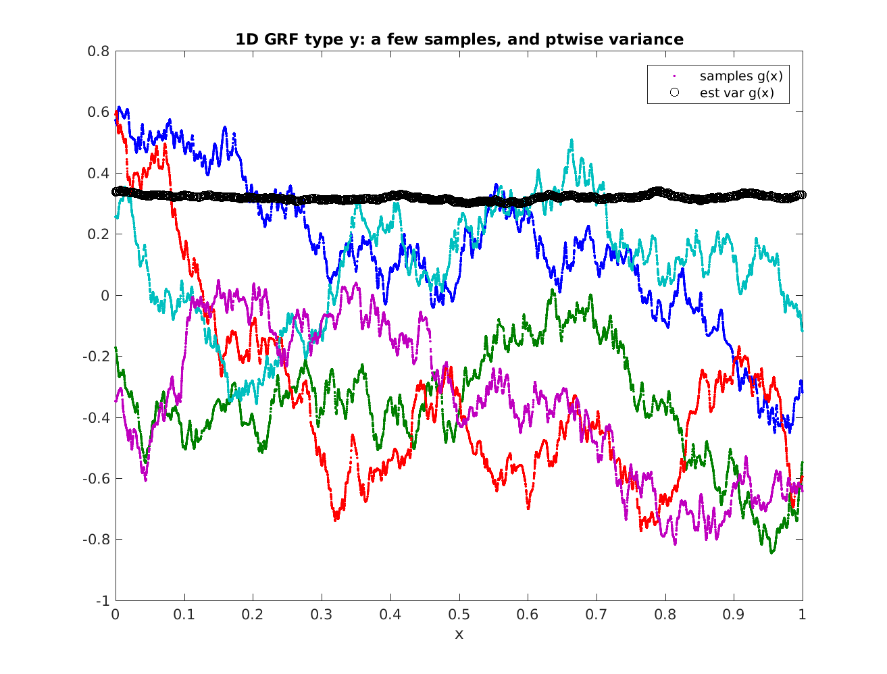

.. _grf:

Efficient sampling from Gaussian Random Fields (GRFs)
======================================================================

A GRF is a random function defined by its power spectral density (PSD)
$\hat{C}(k)$ as a function of wavevector $k$.
It is thus stationary, ie, its statistical properties are translationally
invariant.
It is also known as a Gaussian process prior.
Given a GRF model,
it is important to be able to 1) draw independent samples from the GRF
at a given set of target points,
and 2) compute the log likelihood (under the model) of a given function values at a given set of target points.
We focus on the first application. (For the second, see the Ambikasaran
et al reference at the bottom of this page.)

For certain PSDs, independent samples may be generated by solving
a PDE with iid random forcing; however this slow and
introduces boundary effects.
Here we simply use Fourier methods to sample directly from any PSD
that is a smooth function of $k$,
and evaluate at arbitrary target points.
This is a numerical implementation of the Cram&eacute;r spectral
representation of a GRF (see references below).
The idea is that a *regular* Fourier grid $k_j$ be used, with
spacing sufficiently small based upon the size of the spatial domain
in which target points lie. This serves as a good quadrature scheme
for any smooth PSD.
The GRF model corresponds to random iid coefficients
at these Fourier values, with zero mean and variance $\hat{C}(k_j)$.
These coefficients are then evaluated at all target points using a single
type 2 NUFFT.

The `code <https://github.com/flatironinstitute/finufft/blob/master/tutorial/samplegrf1d.m>`_ is rudimentary but commented to be self-explanatory:

.. literalinclude:: ../../tutorial/samplegrf1d.m
   :language: matlab

The result is as follows, showing 5 samples from a Yukawa or
Matern kernel, plus the pointwise variance estimated from 300 samples:

The calculation takes around 1 second.

If $\hat{C}(k)$ has singularities or discontinuities, a more specialized
$k$-space quadrature scheme would be preferred for high-order accuracy
(low bias).
For an example of this, sampling from a 2D GRF, see
`random plane waves <https://users.flatironinstitute.org/~ahb/rpws/>`_.

Further reading
~~~~~~~~~~~~~~~~

For background on Gaussian random fields, aka stationary Gaussian processes,
see:

  * C E Rasmussen & C K I Williams, *Gaussian Processes for Machine Learning*, the MIT Press, 2006. http://www.GaussianProcess.org/gpml

  * Fast Direct Methods for Gaussian Processes,
    Sivaram Ambikasaran, Daniel Foreman-Mackey, Leslie Greengard,
    David W. Hogg, and Michael O’Neil. arxiv:1403.6015 (2015)

For background on computational sampling methods for GRFs (both use crude k-quadrature in the 1D setting):

  * Shinozuka & Deodatis, "Simulation of Stochastic Processes by Spectral Representation," Applied Mechanics Reviews 44(4), 191–204 (1991)

  * On the spectral representation method in simulation, M. Grigoriu, Prob. Engs. Mech. 8(2) 75-80 (1993)

