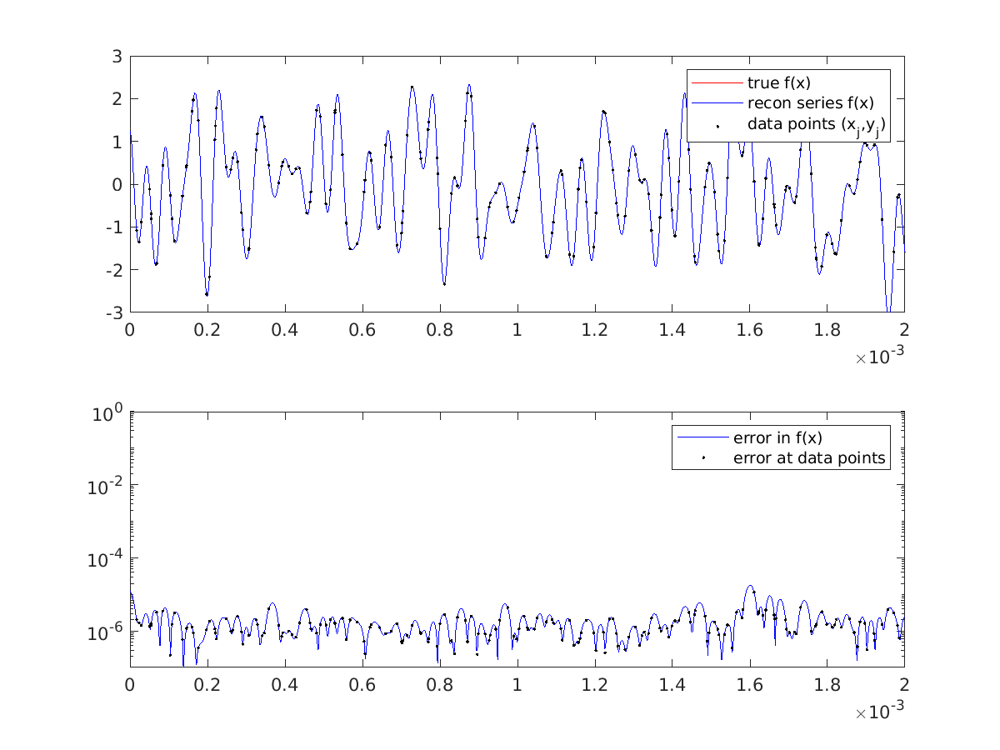
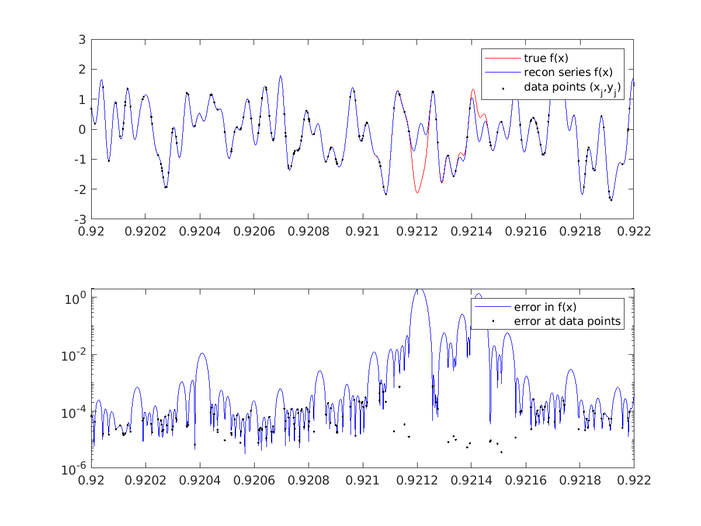

.. _inv1d2:

Inverse 1D type 2 NUFFT: fitting a Fourier series to scattered samples
======================================================================

This tutorial demonstrates inversion of the NUFFT using an iterative
solver and FINUFFT. For convenience it is in MATLAB/Octave.
The task is to solve for $N$ Fourier series coefficients $f_k$,
indexed by $-N/2 \le k < N/2$, given
samples $y_j$, $j=1,\dots,M$ of an unknown
$2\pi$-periodic function $f(x)$ at some given nodes $x_j$, $j=1,\dots,M$.
This has applications in signal analysis, as well
as being a 1D version of the MRI problem
(where the roles of real vs Fourier space are flipped).
Note that there are many other methods to fit smooth functions from
nonequispaced samples, eg high-order local Lagrange interpolation.
However, often your model for the function is a global Fourier series,
in which case, what we describe below is a good starting point.
We assume that the samples are noise-free and no regularization is
needed. We illustrate a well-conditioned then an ill-conditioned case.

Here's code to set up a random complex-valued
test problem of size 600000 by 300000 (way too large to solve directly):

.. code-block:: matlab

  N = 3e5;                             % how many unknown coeffs
  ks = -floor(N/2) + (0:N-1);          % row vec of the frequency k indices
  M = 2*N;                             % overdetermined by a factor 2
  x = 2*pi*((0:M-1)' + 2*rand(M,1))/M; % jittered-from-uniform points on the periodic domain
  ftrue = randn(N,1) + 1i*randn(N,1);  % choose known Fourier coeffs at k inds
  ftrue = ftrue/sqrt(N);               % scale signal f(x) to variance=1, Re or Im part
  y = finufft1d2(x,+1,1e-12,ftrue);    % eval noiseless data at high accuracy

Well-conditioned example
------------------------

The linear system to solve is

.. math:: \sum_{-N/2\le k<N/2} e^{ik x_j} f_k = y_j
  \qquad \mbox{for } j=1,\dots,M.
  :label: linsys
          
This is formally overdetermined ($M>N$), although it may still
be ill-conditioned when the distribution of sample points $\{x_j\}$ has large gaps.
The above jittered point choice has no gaps larger than about 0.8 wavelengths
at the max frequency $N/2$, and will turn out to be well-conditioned.
It is to be solved in the least-squares sense. It is abbreviated by

.. math:: A{\bf f} = {\bf y}

where the $M\times N$ matrix has elements $A_{jk} = e^{ik x_j}$.
Left-multiplying by the conjugate $A^*$ gives the normal equations

.. math:: A^* A{\bf f} = A^* {\bf y}

where the system matrix $A^*A$ is symmetric positive definite,
so we use conjugate gradients (CG) to solve it iteratively.
We first evaluate the normal equations right-hand side via

.. code-block:: matlab

  rhs = finufft1d1(x,y,-1,tol,N);      % compute A^* y

We compare two ways to multiply $A^* A$ to a vector (perform the "matvec")
in the iterative solver.

**1) Matvec via a sequential pair of NUFFTs.** Here the matvec code is

.. code-block:: matlab

  function AHAf = applyAHA(f,x,tol)   % use pair of NUFFTs to apply A^*A to f
    Af = finufft1d2(x,+1,tol,f);                 % apply A
    AHAf = finufft1d1(x,Af,-1,tol,length(f));    % then apply A^*
  end

We target 6 digits from CG using this matvec function, then test the
residual and actual solution error:

.. code-block:: matlab

  [f,flag,relres,iter] = pcg(@(f) applyAHA(f,x,1e-6), rhs, 1e-6, N);
  fprintf('rel l2 resid of Af=y: %.3g\n', norm(finufft1d2(x,+1,tol,f)-y)/norm(y))
  fprintf('rel l2 coeff err: %.3g\n', norm(f-ftrue)/norm(ftrue))

This reaches ``relres<1e-6`` in 28 iterations,
indicating a well-conditioned system.
This takes 1.6 seconds on an 8-core laptop. The residual of the original
system and the error from the true coefficients are quite close to the
normal equation residual::

  rel l2 resid of Ax=y: 1.69e-06
  rel l2 coeff err: 4.14e-06

Also of interest is the maximum (uniform or $L^\infty$) error, which we can
estimate on a fine grid:

.. code-block:: matlab

  ng = 10*N; xg = 2*pi*(0:ng)/ng;          % set up fine plot grid
  ytrueg = finufft1d2(xg,+1,1e-12,ftrue);  % eval true series there
  yg = finufft1d2(xg,+1,1e-12,f);          % eval recovered series there
  fprintf('abs max err: %.3g\n', norm(yg-ytrueg,inf))

This returns ``abs max err: 0.00146``, 3 digits worse than the $\ell_2$
coefficient error, indicating that there are some locations for the problem
which are not entirely well-conditioned. Yet, almost everywhere we see excellent matching of the recovered to the true function to 5-6 digits, for instance
in this zoom in of the first 0.03% of the periodic domain:

**2) Matvec exploiting Toeplitz structure via a pair of padded FFTs.**
A beautiful realization comes from examining the
usual matrix-matrix multiplication formula
for entries of the system matrix for the normal equations,

.. math:: (A^* A)_{k,k'} = \sum_{j=1}^M e^{i(k-k')x_j}
  \qquad \mbox{for } -N/2 \le k,k' < N/2.

We see the $k,k'$-entry only depends on $k-k'$, thus $A^*A$ is
Toeplitz (constant along diagonals). Its action on a vector is
thus a discrete convolution with a length $2N-1$ vector that we call $v$.
From the above formula, $v$ may be filled via a type 1 NUFFT with
unit strengths:

.. code-block:: matlab

  v = finufft1d1(x, ones(size(x)), -1, tol, 2*N-1);  % Toep vec, inds -(N-1):(N+1)
  vhat = fft([v;0]);                                 % pad to length 2N

We now use a pair of padded FFTs in a function (see ``tutorial/applyToep.m`` for the documented self-testing version) which applies the discrete convolution to any vector $f$:

.. code-block:: matlab

  function Tf = applyToep(f,vhat)          % perform Toeplitz matvec on vector f
    N = numel(f);
    fpadhat = fft(f(:),2*N);               % first zero-pads out to size of vhat
    Tf = ifft(fpadhat .* vhat(:));         % do periodic convolution
    Tf = Tf(N:end-1);                      % extract correct chunk of padded output
  end

.. note::

   Since FFTs are periodic, the minimum length that padded FFTs can be to correctly compute the central $N$ entries of the nonperiodic convolution of a length $N$ vector with a length $2N-1$ vector is $2N-1$. However, for $N=3\times 10^5$, $2N-1=599999$ is prime! Its FFT is several times slower than one of length $2N$. Thus we choose $2N$ as the padded length; a more optimized code might pad to the next 5-smooth even number above $2N-1$, using, eg, `next235even <https://github.com/flatironinstitute/finufft/blob/9a1fae7ab1c2f6b1e51c8907b4d6483d5b55f716/src/utils_precindep.cpp#L15>`_.

The solver command with this matvec is:

.. code-block:: matlab

  [f,flag,relres,iter] = pcg(@(f) applyToep(f,vhat), rhs, 1e-6, N);

The resulting iteration count is identical to that for the NUFFT-based matvec,
but the CPU time is now 0.65 seconds, ie, 2.5x faster.
As a reminder, this is because the spreading/interpolation operations in the NUFFTs are avoided (the FFT sizes in the NUFFTs being similar to those in this Toeplitz matvec). The errors and plots are very similar to before.

Ill-conditioned example
-----------------------

The conditioning of the inverse NUFFT problem is set by the nonuniform (sample) point distribution, as well as $N$. To illustrate, we now keep $N$ and $M$ the same, but switch to iid random points:

.. code-block:: matlab

  x = 2*pi*rand(M,1);
                
We use the Toeplitz FFT matvec (method 2 above), and now find that CG
reaches the requested ``relres<1e-6`` in a huge 1461 iterations
(the large count implying poor conditioning), taking 35 seconds. The above error
diagnosis code lines now give::

  rel l2 resid of Af=y: 2.62e-05
  rel l2 coeff err: 0.0236
  abs max err: 2.4

Here the residual shows that *the linear system was still solved reasonably accurately*, but that the coefficient error is now much worse.
This is typical behavior for an ill-conditioned problem.
Their ratio of coefficient error to residual (both in $\ell_2$ norms)
places a lower bound on the condition
number $\kappa(A)$ of about 900. This explains the large iteration count
for the normal equations, since their condition number is $\kappa(A^*A) = \kappa(A)^2$.

The error in the signal $f(x)$ turns out to be very unequally distributed
for this problem: it is correct to 4-5 digits almost everywhere,
including at almost all the data points,
while errors are ${\cal O}(1)$ only near the very largest gaps
between the (iid random) sample points. Here is a picture near such a gap:

The gap near $x\approx 0.9212$ has size 0.00009, which is about
two wavelengths at the Nyquist frequency $N/2$.
The observed ill-conditioning is a feature of the *problem*, and cannot
be changed by a different solution method.
Indeed, it can be shown mathematically that the problem of
interpolating a band-limited function
is exponentially ill-conditioned with respect to the length of
any node-free gap measured in Nyquist wavelengths. This
partially explains the ill-conditioning observed above.

..  note::
    
  The coefficient and $f(x)$ reconstruction error could be reduced in the above demo (without changing the conditioning) by reducing the residual (ie, setting a smaller CG stopping criterion); however, the ``1e-6`` relative residual stopping value used already presumes that the data were at least 6-digit accurate (0.0001% measurement error), which is already a stretch in any practical problem. In short, it is not meaningful to demand residuals much lower than the data measurement error.

Two ways to change the problem to reduce ill-conditioning include:
1) changing the sampling point distribution to avoid large gaps, and
2) changing the problem by introducing a **regularization term**.

The 2nd idea here also fits into the iterative NUFFT or Toeplitz frameworks,
and we plan to present it in another tutorial shortly.
We have also not yet discussed the use of **preconditioning** (such as those
for Toeplitz systems in Raymond Chan's book) to reduce the iteration count
of CG.

For the complete code for the above examples and plots, including a naive dense direct solve for small problems (a useful warm-up exercise), see ``tutorial/inv1d2.m``.

Further reading
---------------

For the 1D inversion with $M=N$ and no regularization
there are interpolation methods using
the fast multipole method for the cotangent kernel, eg:

*  A Dutt and V Rokhlin, Fast Fourier transforms for nonequispaced data, II. Appl. Comput. Harmonic Anal. 2, 85–100 (1995)

For the 2D iterative version using a Toeplitz matrix-vector multiply
for CG on the normal equations, in the MRI settings, see:

* J A Fessler et al,  Toeplitz-Based Iterative Image
  Reconstruction for MRI With Correction for Magnetic Field Inhomogeneity.
  IEEE Trans. Sig. Proc. 53(9) 3393 (2005).

For background on condition number of a problem, see Chapters 12-15 of Trefethen and Bau, *Numerical Linear Algebra* (SIAM, 1997).
