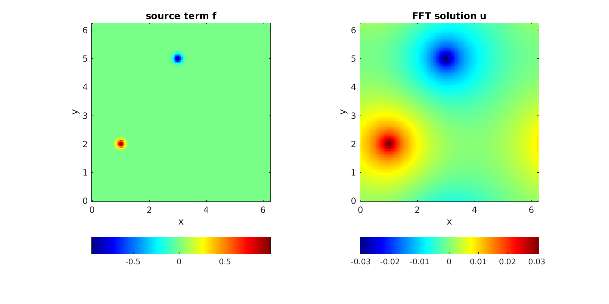
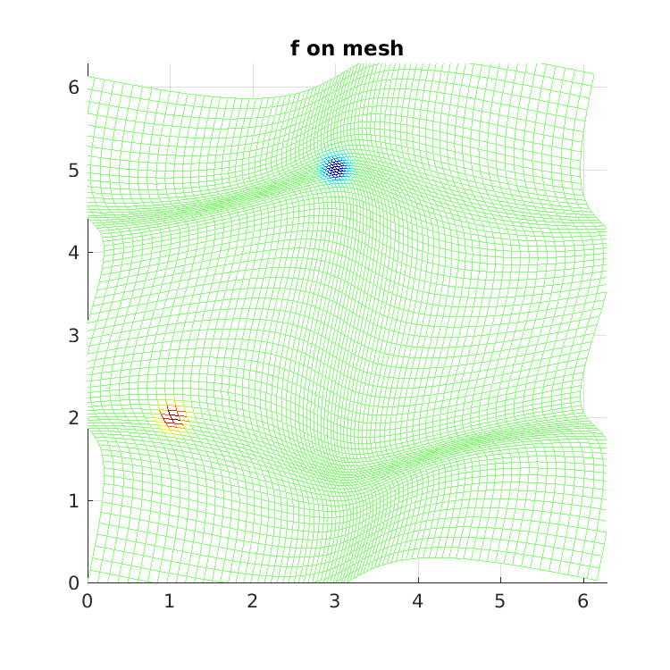
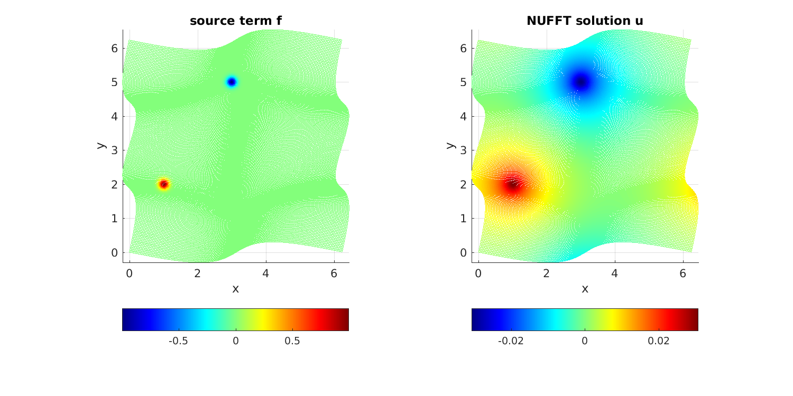
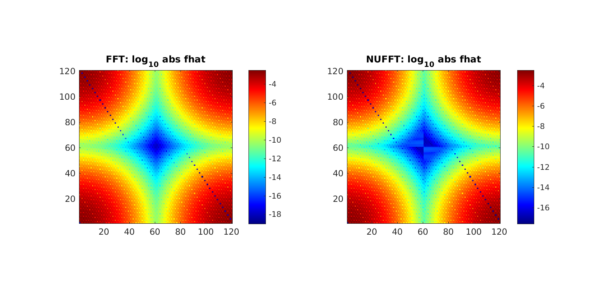

.. _peripois2d:

Periodic Poisson solve on non-Cartesian quadrature grid
=======================================================

It is standard to use the FFT as a fast solver for the Poisson
equation on a periodic domain, say $[0,2\pi)^d$. Namely, given $f$,
find $u$ satisfying

.. math::
   -\Delta u = f~, \qquad \mbox{ where } \int_{[0,2\pi)^d} f \, dx = 0~,

which has a unique solution up to constants. When $f$ and $u$ live on
a regular Cartesian mesh, three steps are needed.
The first takes an FFT to approximate
the Fourier series coefficient array of $f$, the second divides by $\|k\|^2$,
and the third uses another FFT to evaluate the Fourier series for $u$
back on the original grid. Here is a MATLAB demo in $d=2$ dimensions.
Firstly we set up a smooth function, periodic up to machine precision:

.. code-block:: matlab
  
  w0 = 0.1;  % width of bumps
  src = @(x,y) exp(-0.5*((x-1).^2+(y-2).^2)/w0^2)-exp(-0.5*((x-3).^2+(y-5).^2)/w0^2);

Now we do the FFT solve, using a loop to check convergence with respect to
``n`` the number of grid points in each dimension:

.. code-block:: matlab
  
  ns = 40:20:120;              % convergence study of grid points per side
  for i=1:numel(ns), n = ns(i);
    x = 2*pi*(0:n-1)/n;        % grid
    [xx yy] = ndgrid(x,x);     % ordering: x fast, y slow
    f = src(xx,yy);            % eval source on grid
    fhat = ifft2(f);           % step 1: Fourier coeffs by Euler-F projection
    k = [0:n/2-1 -n/2:-1];     % Fourier mode grid
    [kx ky] = ndgrid(k,k);
    kfilter = 1./(kx.^2+ky.^2);    % -(Laplacian)^{-1} in Fourier space
    kfilter(1,1) = 0;          % kill the zero mode (even if inconsistent)
    kfilter(n/2+1,:) = 0; kfilter(:,n/2+1) = 0;  % kill n/2 modes since non-symm
    u = fft2(kfilter.*fhat);   % steps 2 and 3
    u = real(u);
    fprintf('n=%d:\t\tu(0,0) = %.15e\n',n,u(1,1))   % check conv at a point
  end

We observe spectral convergence to 14 digits::

  n=40:		u(0,0) = 1.551906153625019e-03
  n=60:		u(0,0) = 1.549852227637310e-03
  n=80:		u(0,0) = 1.549852190998224e-03
  n=100:	u(0,0) = 1.549852191075839e-03
  n=120:	u(0,0) = 1.549852191075828e-03

Here we plot the FFT solution:

.. code-block:: matlab
  
  figure; subplot(1,2,1); imagesc(x,x,f'); colorbar('southoutside');
  axis xy equal tight; title('source term f'); xlabel('x'); ylabel('y');
  subplot(1,2,2); imagesc(x,x,u'); colorbar('southoutside');
  axis xy equal tight; title('FFT solution u'); xlabel('x'); ylabel('y');

           
Now let's say you wish to do a similar Poisson solve on a **non-Cartesian grid** covering the same
domain. There are two cases: a) the grid is unstructured and you do
not know the weights of a quadrature scheme, or b) you do know the weights
of a quadrature scheme (which ususally implies that the grid is
structured, such as arising from a different coordinate system or an adaptive subdivision). By *quadrature scheme* we mean nodes $x_j \in \mathbb{R}^d$,
$j=1,\dots, M$, and
weights $w_j$ such that, for all smooth functions $f$,

.. math::   
  \int_{[0,2\pi)^d} f(x) dx \approx \sum_{j=1}^M f(x_j) w_j

holds to sufficient accuracy. We consider case b) only.
For demo purposes, we use a simple smooth
diffeomorphism from $[0,2\pi)^2$ to itself to define a distorted mesh
(the associated quadrature weights will come from the determinant of the
Jacobian):

.. code-block:: matlab
  
  map = @(t,s) [t + 0.5*sin(t) + 0.2*sin(2*s); s + 0.3*sin(2*s) + 0.3*sin(s-t)];
  mapJ = @(t,s) [1 + 0.5*cos(t), 0.4*cos(2*s); ...
                -0.3*cos(s-t),  1+0.6*cos(2*s)+0.3*cos(s-t)]; % its 2x2 Jacobian

For convenience of checking the solution against the above one, we chose the
map to take the origin to itself. To visualize the grid, we plot $f$ on it,
noting that it covers the domain when periodically extended:

.. code-block:: matlab

  t = 2*pi*(0:n-1)/n;           % 1d unif grid
  [tt ss] = ndgrid(t,t);
  xxx = map(tt(:)',ss(:)');
  xx = reshape(xxx(1,:),[n n]); yy = reshape(xxx(2,:),[n n]);  % 2D NU pts
  f = src(xx,yy);
  figure; mesh(xx,yy,f); view(2); axis equal; axis([0 2*pi 0 2*pi]); title('f on mesh');

           
To solve on this grid, replace step 1 above by evaluating the Euler-Fourier formula using the quadrature scheme, which needs a type-1 NUFFT, and step 3 (evaluation on the nonuniform grid) by a type-2 NUFFT. Step 2 (the frequency filter) remains the same. Here is the demo code:

.. code-block:: matlab

  tol = 1e-12;            % NUFFT precision
  ns = 80:40:240;         % convergence study of grid points per side
  for i=1:numel(ns), n = ns(i);
    t = 2*pi*(0:n-1)/n;   % 1d unif grid
    [tt ss] = ndgrid(t,t);
    xxx = map(tt(:)',ss(:)');
    xx = reshape(xxx(1,:),[n n]); yy = reshape(xxx(2,:),[n n]);  % 2d NU pts
    J = mapJ(tt(:)',ss(:)');
    detJ = J(1,1:n^2).*J(2,n^2+1:end) - J(2,1:n^2).*J(1,n^2+1:end);
    ww = detJ / n^2;      % 2d quadr weights, including 1/(2pi)^2 in E-F integr
    f = src(xx,yy);
    Nk = 0.5*n; Nk = 2*ceil(Nk/2);  % modes to trust due to quadr err
    o.modeord = 1;        % use fft output mode ordering
    fhat = finufft2d1(xx(:),yy(:),f(:).*ww(:),1,tol,Nk,Nk,o);  % do E-F
    k = [0:Nk/2-1 -Nk/2:-1];   % Fourier mode grid
    [kx ky] = ndgrid(k,k);
    kfilter = 1./(kx.^2+ky.^2);  % inverse -Laplacian in k-space (as above)
    kfilter(1,1) = 0; kfilter(Nk/2+1,:) = 0; kfilter(:,Nk/2+1) = 0;
    u = finufft2d2(xx(:),yy(:),-1,tol,kfilter.*fhat,o);  % eval filt F series @ NU
    u = reshape(real(u),[n n]);
    fprintf('n=%d:\tNk=%d\tu(0,0) = %.15e\n',n,Nk,u(1,1))  % check conv at same pt
  end
            
Here a convergence parameter (``Nk = 0.5*n``) had to be set to
choose how many modes to trust with the quadrature. Thus ``n`` is about
twice what it needed to be in the uniform case, accounting for the stretching
of the grid.
The convergence is again spectral, down to at least ``tol``,
and matches the FFT solution at the test point to 12 relative digits::

  n=80:	        Nk=40	u(0,0) = 1.549914931081811e-03
  n=120:	Nk=60	u(0,0) = 1.549851996895389e-03
  n=160:	Nk=80	u(0,0) = 1.549852191032026e-03
  n=200:	Nk=100	u(0,0) = 1.549852191076891e-03
  n=240:	Nk=120	u(0,0) = 1.549852191077001e-03

           
Finally, here is the decay of the modes $\hat{f}_k$ on a log plot, for the
FFT and NUFFT versions. They are identical down to the level ``tol``:

           
The full code is at
`tutorial/poisson2dnuquad.m <https://github.com/flatironinstitute/finufft/blob/master/tutorial/poisson2dnuquad.m>`_.

.. note::
   If the non-Cartesian grids were of *tensor product* form,
   one could instead exploit 1D NUFFTs for the above, and, most likely
   the use of BLAS3 (``ZGEMM`` with an order-``n`` dense NUDFT matrix) would be
   optimal.

.. note::
   Using the NUFFT as above does *not* give an optimal scaling scheme in the case of
   a **fully adaptive grid**, because all frequencies must be handled up to the highest
   one needed. The latter is controlled by the smallest spatial scale, so that the number of modes needed, $N$, is no smaller than the number in a *uniform* spatial discretization of the original domain at resolution needed to capture the smallest features. In other words, the advantage of full adaptivity is lost when using the NUFFT, and one may as well have used the FFT with a uniform Cartesian grid. To remedy this and recover linear complexity in the fully adaptive case, an FMM could be used to convolve $f$ with the (periodized) Laplace fundamental solution to obtain $u$, or a multigrid or direct solver used on the discretization of the Laplacian on the adaptive grid.
