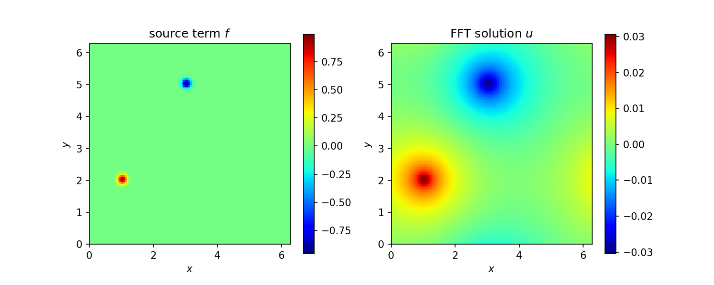
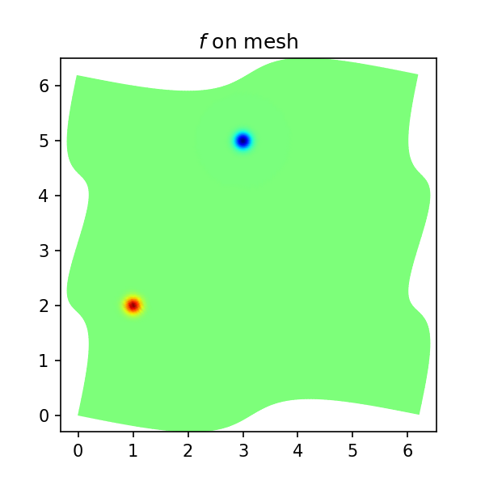
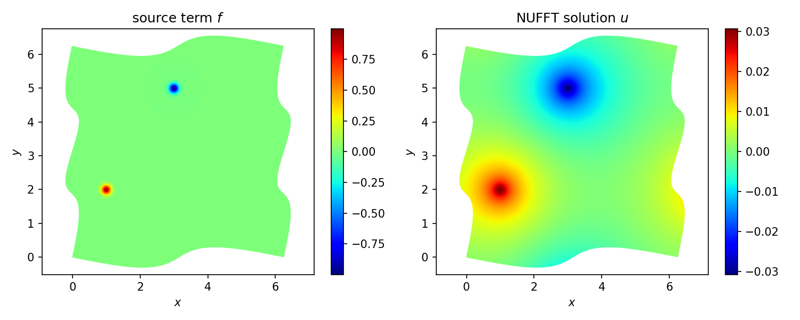
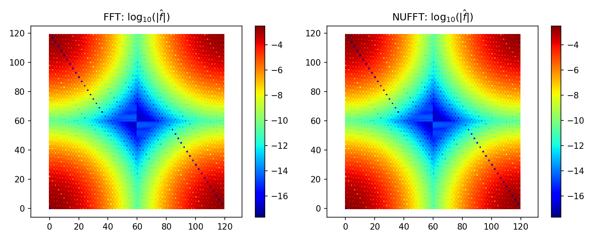

.. _peripois2d_python:

Periodic Poisson solve on non-Cartesian quadrature grid (Python)
================================================================

This is a Python translation of :ref:`this MATLAB tutorial<peripois2d>`.

It is standard to use the FFT as a fast solver for the Poisson
equation on a periodic domain, say $[0,2\pi)^d$. Namely, given $f$,
find $u$ satisfying

.. math::
   -\Delta u = f~, \qquad \mbox{ where } \int_{[0,2\pi)^d} f \, dx = 0~,

which has a unique solution up to constants. When $f$ and $u$ live on
a regular Cartesian mesh, three steps are needed.
The first takes an FFT to approximate
the Fourier series coefficient array of $f$, the second divides by $\|k\|^2$,
and the third uses another FFT to evaluate the Fourier series for $u$
back on the original grid. Here is a Python demo in $d=2$ dimensions.
First, we have to import some packages:

.. code-block:: python

  import finufft
  import numpy as np
  np.seterr(divide='ignore')  # Disable division by zero warning
  from matplotlib.colors import CenteredNorm
  import matplotlib.pyplot as plt

Then, we set up a smooth function, periodic up to machine precision:

.. code-block:: python

  w0 = 0.1 # width of bumps
  src = lambda x, y: np.exp(-0.5*((x-1)**2+(y-2)**2)/w0**2)-np.exp(-0.5*((x-3)**2+(y-5)**2)/w0**2)

Now we do the FFT solve, using a loop to check convergence with respect to
``n`` the number of grid points in each dimension:

.. code-block:: python

  for n in range(40, 120 + 20, 20):               # convergence study of grid points per side
      x = 2*np.pi*np.arange(n) / n                # grid
      xx, yy = np.meshgrid(x, x)                  # ordering: x fast, y slow
      f = src(xx,yy)                              # eval source on grid
      fhat = np.fft.ifft2(f)                      # step 1: Fourier coeffs by Euler-F projection
      k = np.fft.fftfreq(n) * n                   # Fourier mode grid
      kx, ky = np.meshgrid(k, k)
      kfilter = 1. / (kx**2 + ky**2)              # -(Laplacian)^{-1} in Fourier space
      kfilter[0, 0] = 0                           # kill the zero mode (even if inconsistent)
      kfilter[n//2, :] = 0
      kfilter[:, n//2] = 0                        # kill n/2 modes since non-symm
      u = np.fft.fft2(kfilter * fhat).real        # steps 2 and 3
      print(f"n={n}:\t\tu(0,0) = {u[0,0]:.15e}")  # check conv at a point

We observe spectral convergence to 14 digits::

  n=40:         u(0,0) = 1.551906153625019e-03
  n=60:         u(0,0) = 1.549852227637310e-03
  n=80:         u(0,0) = 1.549852190998226e-03
  n=100:        u(0,0) = 1.549852191075839e-03
  n=120:        u(0,0) = 1.549852191075829e-03

Here we plot the FFT solution:

.. code-block:: python

  fig, ax = plt.subplots(1, 2, figsize=[10, 4], dpi=150)
  imshow_args = {"origin": "lower", "cmap": "jet", "extent": [0.0, 2.*np.pi, 0.0, 2.*np.pi]}
  cax = ax[0].imshow(f, **imshow_args)
  fig.colorbar(cax, ax=ax[0])
  ax[0].set_xlabel("$x$")
  ax[0].set_ylabel("$y$")
  ax[0].set_title("source term $f$")
  cax = ax[1].imshow(u, **imshow_args)
  fig.colorbar(cax, ax=ax[1])
  ax[1].set_xlabel("$x$")
  ax[1].set_ylabel("$y$")
  ax[1].set_title("FFT solution $u$")
  plt.savefig("pois_fft_python.png")
  fig.tight_layout()
  plt.show()

Now let's say you wish to do a similar Poisson solve on a **non-Cartesian grid** covering the same
domain. There are two cases: a) the grid is unstructured and you do
not know the weights of a quadrature scheme, or b) you do know the weights
of a quadrature scheme (which ususally implies that the grid is
structured, such as arising from a different coordinate system or an adaptive subdivision). By *quadrature scheme* we mean nodes $x_j \in \mathbb{R}^d$,
$j=1,\dots, M$, and
weights $w_j$ such that, for all smooth functions $f$,

.. math::
  \int_{[0,2\pi)^d} f(x) dx \approx \sum_{j=1}^M f(x_j) w_j

holds to sufficient accuracy. We consider case b) only.
For demo purposes, we use a simple smooth
diffeomorphism from $[0,2\pi)^2$ to itself to define a distorted mesh
(the associated quadrature weights will come from the determinant of the
Jacobian):

.. code-block:: python

  deform = lambda t, s: np.stack([t + 0.5*np.sin(t) + 0.2*np.sin(2*s), s + 0.3*np.sin(2*s) + 0.3*np.sin(s-t)])
  deformJ = lambda t, s: np.stack([
      np.stack([1 + 0.5*np.cos(t), 0.4*np.cos(2*s)], axis=-1),
      np.stack([-0.3*np.cos(s-t), 1+0.6*np.cos(2*s)+0.3*np.cos(s-t)], axis=-1)
  ], axis=-1) # its 2x2 Jacobian

For convenience of checking the solution against the above one, we chose the
map to take the origin to itself. To visualize the grid, we plot $f$ on it,
noting that it covers the domain when periodically extended:

.. code-block:: python

  t = 2 * np.pi * np.arange(n) / n           # 1d unif grid
  tt, ss = np.meshgrid(t, t)
  xxx = deform(tt, ss)
  xx, yy = xxx[0], xxx[1]
  f = src(xx, yy)
  fig, ax = plt.subplots(1, 1, figsize=[4, 4], dpi=150)
  cax = ax.pcolormesh(xx, yy, f, shading='gouraud', cmap="jet", norm=CenteredNorm())
  ax.set_title("$f$ on mesh")
  ax.axis("equal")
  plt.savefig("pois_nugrid_python.png")
  plt.show()

To solve on this grid, replace step 1 above by evaluating the Euler-Fourier formula using the quadrature scheme, which needs a type-1 NUFFT, and step 3 (evaluation on the nonuniform grid) by a type-2 NUFFT. Step 2 (the frequency filter) remains the same. Here is the demo code:

.. code-block:: python

  tol = 1e-12                               # NUFFT precision
  for n in range(80, 240 + 40, 40):         # convergence study of grid points per side
      t = 2 * np.pi * np.arange(n) / n      # 1d unif grid
      tt, ss = np.meshgrid(t, t)
      xxx = deform(tt, ss)
      xx, yy = xxx[0], xxx[1]               # 2d NU pts
      J = deformJ(tt.T, ss.T)
      detJ = np.linalg.det(J).T
      ww = detJ / n**2                      # 2d quadr weights, including 1/(2pi)^2 in E-F integr
      f = src(xx, yy)
      Nk = 0.5 * n
      Nk = int(2 * np.ceil(Nk / 2))         # modes to trust due to quadr err
      fhat = finufft.nufft2d1(xx.ravel(), yy.ravel(), (f * ww).ravel().astype(np.complex128),
                              n_modes=(Nk, Nk), isign=1, eps=tol, modeord=1);  # do E-F
      k = np.fft.fftfreq(Nk) * Nk           # Fourier mode grid
      kx, ky = np.meshgrid(k, k)
      kfilter = 1. / (kx**2 + ky**2)        # -(Laplacian)^{-1} in Fourier space
      kfilter[0,0] = 0                      # kill the zero mode (even if inconsistent)
      kfilter[Nk//2,:] = 0
      kfilter[:,Nk//2] = 0                  # kill Nk/2 modes since non-symm
      u = finufft.nufft2d2(xx.ravel(), yy.ravel(), (kfilter * fhat),
                          isign=-1, eps=tol, modeord=1).real.reshape((n,n))  # eval filt F series @ NU
      print(f"n={n}:\t\tNk={Nk}\tu(0,0) = {u[0,0]:.15e}")   # check conv at a point

Here a convergence parameter (``Nk = 0.5*n``) had to be set to
choose how many modes to trust with the quadrature. Thus ``n`` is about
twice what it needed to be in the uniform case, accounting for the stretching
of the grid.
The convergence is again spectral, down to at least ``tol``,
and matches the FFT solution at the test point to 12 relative digits::

  n=80:	        Nk=40	u(0,0) = 1.549914931081811e-03
  n=120:	Nk=60	u(0,0) = 1.549851996895389e-03
  n=160:	Nk=80	u(0,0) = 1.549852191032026e-03
  n=200:	Nk=100	u(0,0) = 1.549852191076891e-03
  n=240:	Nk=120	u(0,0) = 1.549852191077001e-03

.. code-block:: python

  fig, ax = plt.subplots(1, 2, figsize=[10, 4], dpi=150)
  pcolormesh_args = {"shading": "gouraud", "cmap": "jet"}
  cax = ax[0].pcolormesh(xx, yy, f, norm=CenteredNorm(), **pcolormesh_args)
  fig.colorbar(cax, ax=ax[0])
  ax[0].set_xlabel("$x$")
  ax[0].set_ylabel("$y$")
  ax[0].set_title("source term $f$")
  ax[0].axis("equal")
  cax = ax[1].pcolormesh(xx, yy, u, norm=CenteredNorm(), **pcolormesh_args)
  fig.colorbar(cax, ax=ax[1])
  ax[1].set_xlabel("$x$")
  ax[1].set_ylabel("$y$")
  ax[1].set_title("NUFFT solution $u$")
  ax[1].axis("equal")
  fig.tight_layout()
  plt.savefig("pois_nufft_python.png")
  plt.show()

Finally, here is the decay of the modes $\hat{f}_k$ on a log plot, for the
FFT and NUFFT versions. They are identical down to the level ``tol``:

.. code-block:: python

  fig, ax = plt.subplots(1, 2, figsize=[10, 4], dpi=150)
  cax = ax[0].imshow(np.log10(np.abs(fhat)), origin="lower", cmap="jet")
  fig.colorbar(cax, ax=ax[0])
  ax[0].set_title(r"FFT: $\mathrm{log}_{10}(|\hat{f}|)$")
  ax[0].axis("equal")
  cax = ax[1].imshow(np.log10(np.abs(fhat)), origin="lower", cmap="jet")
  fig.colorbar(cax, ax=ax[1])
  ax[1].set_title(r"NUFFT: $\mathrm{log}_{10}(|\hat{f}|)$")
  ax[1].axis("equal")
  fig.tight_layout()
  plt.savefig("pois_fhat_python.png")
  plt.show()

The full code is at
`tutorial/poisson2dnuquad.py <https://github.com/flatironinstitute/finufft/blob/master/tutorial/poisson2dnuquad.py>`_.

.. note::
   If the non-Cartesian grids were of *tensor product* form,
   one could instead exploit 1D NUFFTs for the above, and, most likely
   the use of BLAS3 (``ZGEMM`` with an order-``n`` dense NUDFT matrix) would be
   optimal.

.. note::
   Using the NUFFT as above does *not* give an optimal scaling scheme in the case of
   a **fully adaptive grid**, because all frequencies must be handled up to the highest
   one needed. The latter is controlled by the smallest spatial scale, so that the number of modes needed, $N$, is no smaller than the number in a *uniform* spatial discretization of the original domain at resolution needed to capture the smallest features. In other words, the advantage of full adaptivity is lost when using the NUFFT, and one may as well have used the FFT with a uniform Cartesian grid. To remedy this and recover linear complexity in the fully adaptive case, an FMM could be used to convolve $f$ with the (periodized) Laplace fundamental solution to obtain $u$, or a multigrid or direct solver used on the discretization of the Laplacian on the adaptive grid.
