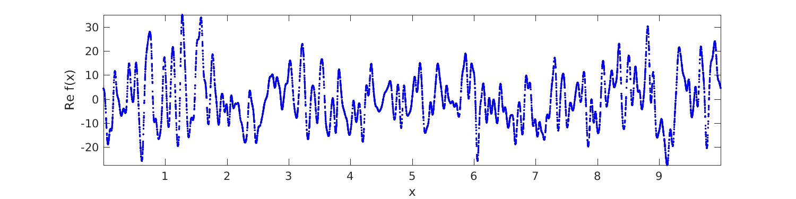
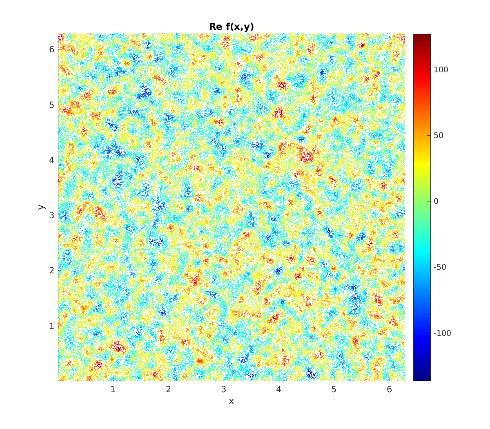

.. _serieseval:

Fast evaluation of Fourier series at arbitrary points
=====================================================

This is a simple demo of using type 2 NUFFTs to evaluate a given
1D and then 2D Fourier series rapidly (close to optimal scaling)
at arbitrary points.
For conciseness of code, we use the MATLAB interface.
The series we use are vaguely boring random ones relating
to :ref:`Gaussian random fields<grf>`---please
insert Fourier series coefficient vectors you care about.

1D Fourier series
~~~~~~~~~~~~~~~~~~

Let our periodic domain be $[0,L)$, so that we get to see how to
rescale from the fixed period of $2\pi$ in FINUFFT.
We set up a random Fourier series with Gaussian decaying coefficients
(this in fact is a sample from a stationary *Gaussian random field*,
or *Gaussian process* with covariance kernel itself a periodized Gaussian):

.. code-block:: matlab

  L = 10;             % period
  kmax = 500;         % bandlimit
  k = -kmax:kmax-1;   % freq indices (negative up through positive mode ordering)
  N = 2*kmax;         % # modes
  rng(0);             % make some convenient Fourier coefficients...
  fk = randn(N,1)+1i*randn(N,1);       % iid random complex data, column vec
  k0 = 100;           % a freq scale parameter
  fk = fk .* exp(-(k/k0).^2).';        % scale the amplitudes, kills high freqs

Now we use a 1D type 2 to evaluate this series at a large number of
points very quickly:

.. code-block:: matlab

  M = 1e6; x = L*rand(1,M);        % make random target points in [0,L)
  tol = 1e-12;
  x_scaled = x * (2*pi/L);         % don't forget to scale to 2pi-periodic!
  tic; c = finufft1d2(x_scaled,+1,tol,fk); toc   % evaluate Fourier series at x

::

  Elapsed time is 0.026038 seconds.

Compare this to a naive calculation (which serves to remind us exactly what sum FINUFFT approximates):

.. code-block:: matlab

  tic; cn = 0*c; for m=k, cn = cn + fk(m+N/2+1)*exp(1i*m*x_scaled.'); end, toc
  norm(c-cn,inf)

::
                
  Elapsed time is 11.679265 seconds.
  ans =
        1.76508266507874e-11

Thus, with only $10^3$ modes, FINUFFT is 500 times faster than naive
multithreaded summation. (Naive summation with reversed loop order is even worse, taking 29 seconds.) We plot $1\%$ of the resulting values and get the smooth but randomly-sampled graph below:

.. code-block:: matlab

  Mp = 1e4;               % how many pts to plot
  jplot = 1:Mp;           % indices to plot
  plot(x(jplot),real(c(jplot)),'b.'); axis tight; xlabel('x'); ylabel('Re f(x)');

 
See the full code `tutorial/serieseval1d.m <https://github.com/flatironinstitute/finufft/blob/master/tutorial/serieseval1d.m>`_ which also shows
how to evaluate the same series on a uniform grid via the plain FFT.
           
2D Fourier series
~~~~~~~~~~~~~~~~~

Since we already know how to rescale to periodicity $L$, let's revert to
the natural period and work in the square $[0,2\pi)^2$. We create a random
2D Fourier series, which happens to be for a Gaussian random field with
(doubly periodized) isotropic Matérn kernel of arbitrary power:

.. code-block:: matlab

  kmax = 500;                   % bandlimit per dim
  k = -kmax:kmax-1;             % freq indices in each dim
  N1 = 2*kmax; N2 = N1;         % # modes in each dim
  [k1 k2] = ndgrid(k,k);        % grid of freq indices
  rng(0); fk =  randn(N1,N2)+1i*randn(N1,N2);         % iid random complex modes
  k0 = 30;                     % freq scale parameter
  alpha = 3.7;                 % power; alpha>2 to converge in L^2
  fk = fk .* ((k1.^2+k2.^2)/k0^2 + 1).^(-alpha/2);    % sqrt of spectral density

We then simply call a 2D type 2 to evaluate this double series at whatever
target points you like:

.. code-block:: matlab

   M = 1e6; x = 2*pi*rand(1,M); y = 2*pi*rand(1,M);   % random targets in square
   tol = 1e-9;
   tic; c = finufft2d2(x,y,+1,tol,fk); toc   % evaluate Fourier series at (x,y)'s

::

  Elapsed time is 0.092743 seconds.
     
1 million modes to 1 million points in 92 milliseconds on a laptop is decent.
We check the math (using a relative error measure) at just one (generic) point:

.. code-block:: matlab

  j = 1;                        % do math check on 1st target...
  c1 = sum(sum(fk.*exp(1i*(k1*x(j)+k2*y(j)))));
  abs(c1-c(j)) / norm(c,inf)
                
::
                    
  ans =
        2.30520830208365e-10
            
Finally we use a colored scatter plot to show the first $10\%$ of the points in the square, and see samples of the underlying random field (reminiscent of WMAP microwave background data):

.. code-block:: matlab

  jplot = 1:1e5;           % indices to plot
  scatter(x(jplot),y(jplot),1.0,real(c(jplot)),'filled'); axis tight equal
  xlabel('x'); ylabel('y'); colorbar; title('Re f(x,y)');
                

 
See the full code `tutorial/serieseval2d.m <https://github.com/flatironinstitute/finufft/blob/master/tutorial/serieseval2d.m>`_.

